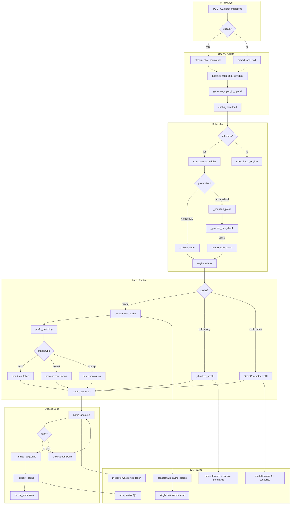
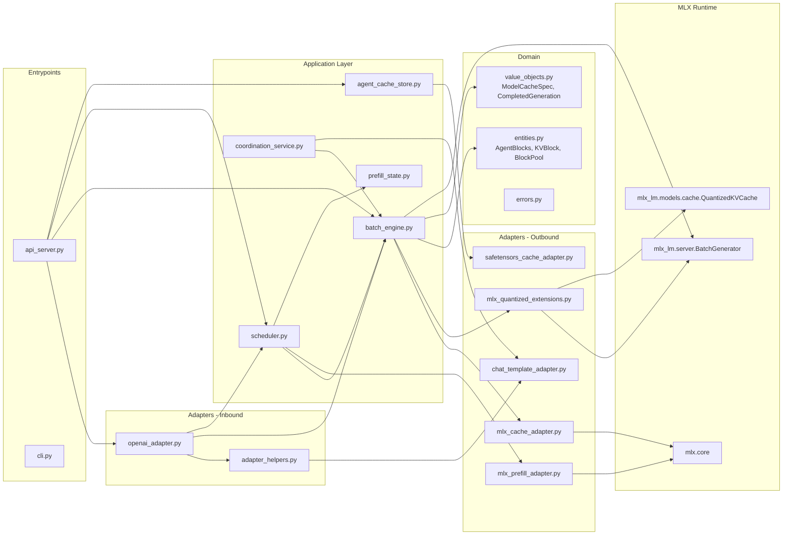

# Semantic Inference Server - Architecture Review & Release Analysis

**Date**: 2026-02-06
**Branch**: `feat/production-architecture`
**MLX**: 0.30.3 | **mlx-lm**: 0.30.4
**Hardware**: Apple M4 Pro 24GB (273 GB/s bandwidth)

---

## 1. System Call Graph



## 2. Module Dependency Map



## 3. Settings Reference

### MLX Settings (`SEMANTIC_MLX_*`)

| Setting | Default | Optimal Gemma 3 12B | Optimal DeepSeek V2 Lite | Notes |
|---------|---------|--------------------|-----------------------|-------|
| `model_id` | DeepSeek-V2-Lite | gemma-3-12b-it-4bit | DeepSeek-V2-Lite-4bit | **BUG: Default is DeepSeek, not Gemma** |
| `max_batch_size` | 2 | 2 | 2 | Limited by 24GB UMA |
| `chunked_prefill_enabled` | True | True | True | |
| `chunked_prefill_threshold` | 2048 | 2048 | 2048 | Below this, standard prefill |
| `chunked_prefill_min_chunk` | 512 | 512 | 512 | |
| `chunked_prefill_max_chunk` | **2048** | **4096** | **4096** | **Benchmark env used 4096; settings default is 2048** |
| `prefill_step_size` | 256 | 256 | 256 | Scheduler interleave chunk |
| `kv_bits` | 4 | 4 | 4 | Q4 quantized KV cache |
| `kv_group_size` | 64 | 64 | 64 | |
| `scheduler_enabled` | True | True | True | |
| `scheduler_interleave_threshold` | 2048 | 2048 | 2048 | |
| `default_max_tokens` | 256 | 256 | 256 | |
| `default_temperature` | 0.7 | 0.0 | 0.0 | Benchmarks use 0.0 |
| `cache_budget_mb` | 8192 | 8192 | 8192 | |
| `block_tokens` | 256 | 256 | 256 | |

### Agent Settings (`SEMANTIC_AGENT_*`)

| Setting | Default | Notes |
|---------|---------|-------|
| `max_agents_in_memory` | 12 | Hot tier capacity |
| `cache_dir` | ~/.semantic/caches | Warm tier location |
| `batch_window_ms` | 10 | Request batching window |
| `evict_to_disk` | True | Enable warm tier |

### Critical Setting Discrepancy

The benchmark env (`OPENAI_BENCH_ENV` in `openai_benchmark.py:61-74`) uses:
```
chunked_prefill_max_chunk = 4096
```
But the settings default is `2048`. This means **all manual server starts use half the chunk size of benchmarks**, potentially causing ~10-20% slower prefill.

---

## 4. Identified Issues

### CRITICAL

#### C1: Default model is DeepSeek, not Gemma
**File**: `settings.py:30`
**Impact**: Server starts with wrong model if `--model` not specified. Benchmark `ServerManager` doesn't pass `--model`, causing benchmarks to run on DeepSeek while claiming Gemma 3 12B results.
**Fix**: Change default to Gemma 3 12B, or add model validation to benchmark scripts.

#### C2: Monkey-patching mlx-lm internals
**File**: `mlx_quantized_extensions.py:643-646`
**Impact**: Three import-time patches to `_make_cache`, `_merge_caches`, and `QuantizedKVCache.merge`. Any mlx-lm update can silently break Q4 pipeline.
**Mitigation**: Version pinned at 0.30.4, but no validation that patches applied correctly at runtime.
**Fix**: Add startup health check that verifies Q4 cache creation works end-to-end.

#### C3: Streaming benchmark doesn't record model name
**File**: `streaming_benchmark.py` (no model field in output JSON)
**Impact**: Impossible to determine which model produced benchmark results from the file alone. Led to paper benchmark confusion (DeepSeek numbers attributed to Gemma).
**Fix**: Add `model_id` to benchmark result metadata.

### HIGH

#### H1: `chunked_prefill_max_chunk` default mismatch — NOT AN ISSUE
**File**: `settings.py:76` (default 2048) vs `openai_benchmark.py:67` (env 4096)
**Analysis**: The 2048 default was intentionally chosen for memory pressure on 24GB systems. The adaptive chunk sizing scales down from this max based on cache position — it's a ceiling, not a fixed value. The benchmark env using 4096 is a benchmark-specific override, not the recommended default.

#### H2: Unnecessary mx.eval() of discarded logits in chunked prefill
**File**: `batch_engine.py:402`
**Impact**: Each non-final chunk evaluates logits that are immediately discarded. Only the cache state matters for intermediate chunks.
**Overhead**: ~10-20ms per chunk wasted, ~5-10% of total prefill time.
**Fix**: Skip mx.eval(y) for non-final chunks; only eval to ensure cache is materialized.

#### H3: mx.clear_cache() after every prefill chunk — FIXED
**File**: `batch_engine.py:403`
**Impact**: Destroyed warmed Metal buffer pool after each chunk, forcing expensive Metal device reallocation of all intermediate tensors (QKV projections, MLP activations) on every iteration. For 4K tokens with 512-token chunks, this destroyed and rebuilt the pool ~8 times.
**Root Cause**: `mx.clear_cache()` calls `buffer_cache_.clear()` in the MLX Metal allocator, releasing all unused but cached buffers. The cache exists for reuse — clearing it defeats the optimization.
**Fix Applied**: Removed unconditional `mx.clear_cache()` from per-chunk loop. The intermediate `y` tensor is naturally freed when Python rebinds the variable next iteration. The codebase's own comment at line 654 already warned: "Do NOT call mx.clear_cache() — that would destroy the warmed Metal memory pool."

#### H4: No MoE-awareness in adaptive chunk sizing — INVESTIGATED
**File**: `batch_engine.py:34-51`
**Analysis**: MoE models (DeepSeek) use ~40% less memory per chunk than dense models (Gemma 3) due to smaller active MLPs and KV cache. Expert routing overhead is negligible (<50MB). Current fixed thresholds are conservative for MoE — safe but suboptimal. MoE could use ~1.6x larger chunks at each tier for better throughput. This is a performance optimization opportunity, not a correctness risk. No immediate fix needed.

### MEDIUM

#### M1: Cache size safety calculation
**File**: `batch_engine.py:598-602`
**Detail**: `bytes_per_token_q4 = n_kv_heads * head_dim * 2 * 0.5 * n_layers` correctly computes total bytes across all layers per token. The calculation is mathematically correct but uses a single variable name suggesting "per token" when it's really "per token across all layers." Confusing but functionally correct.

#### M2: Hardcoded MAX_SAFE_CACHE_MEMORY_MB = 7500
**File**: `batch_engine.py:84`
**Impact**: Not adaptive to device memory. On 48GB M4 Max, this wastes 50% of available memory. On 8GB M2, this could OOM.
**Fix**: Calculate from `mx.metal.device_memory()` at startup.

#### M3: Per-request detokenizer cloning
**File**: `batch_engine.py:1224-1225`
**Impact**: Creates new detokenizer instance per request. Minor overhead (~5ms) but could use object pool.

#### M4: Character-level prefix matching uses Python loop
**File**: `entities.py` `common_prefix_chars()`
**Impact**: For 32K-character prompts, iterates character by character in Python. Could use C-level string comparison.

#### M5: DeepSeek empty response on turn 3+ (coordination) — FIXED
**File**: `coordination_service.py:505-520`
**Impact**: DeepSeek generated empty responses after turn 2 because no explicit prompt was added. Standard models get `[Name, respond now.]` but DeepSeek echoes this text.
**Fix Applied**: Added `else` branch for DeepSeek that appends an assistant-role message with speaker prefix (`{Name}:`). This provides speaker context without echoable text.

---

## 5. Performance Overhead Breakdown

### Cold 4K Request (Gemma 3 12B, M4 Pro)

```
Request arrives at API server
  |-- Tokenize + chat template:     ~5ms
  |-- Cache lookup (miss):           ~1ms
  |-- Block pool allocation:         ~1ms
  |-- Chunked prefill (4095 tokens):
  |     |-- Chunk 1 (4096 tokens):   ~4900ms  (model forward + mx.eval)
  |     \-- Total prefill:           ~4900ms
  |-- BatchGenerator insert:         ~2ms
  |-- Decode loop (28 tokens):
  |     |-- 28 x batch_gen.next():   ~800ms   (~28ms/token)
  |     \-- Detokenize:              ~1ms
  |-- Cache extraction (Q4):         ~50ms
  |-- Cache save to disk:            ~30ms
  |-- Response formation:            ~1ms
  \-- Total:                         ~5800ms
```

### Warm 4K Request (Gemma 3 12B, M4 Pro)

```
Request arrives at API server
  |-- Tokenize + chat template:     ~5ms
  |-- Cache lookup (warm hit):       ~50ms  (disk read + safetensors parse)
  |-- Cache reconstruction:          ~100ms (Q4 concat + single mx.eval)
  |-- Prefix matching:               ~2ms
  |-- Trim to prompt length:         ~5ms
  |-- BatchGenerator insert:         ~2ms
  |-- Decode loop (28 tokens):       ~800ms
  |-- Cache extraction + save:       ~80ms
  \-- Total:                         ~1050ms
```

### Hot 4K Request (Gemma 3 12B, M4 Pro)

```
Request arrives at API server
  |-- Tokenize + chat template:     ~5ms
  |-- Cache lookup (hot hit):        ~1ms   (in-memory)
  |-- Cache reconstruction:          ~100ms (still needed: blocks -> QuantizedKVCache)
  |-- Prefix matching:               ~2ms
  |-- BatchGenerator insert:         ~2ms
  |-- Decode loop (28 tokens):       ~800ms
  |-- Cache extraction + save:       ~80ms
  \-- Total:                         ~990ms
```

---

## 6. Model Architecture Comparison

### Gemma 3 12B (Dense)

| Property | Value |
|----------|-------|
| Parameters | 12B |
| 4-bit model size | 8.03 GB |
| Layers | 48 (26 global + 22 sliding window) |
| KV heads | 8 |
| Head dim | 256 |
| Memory read per decode token | 8.03 GB (full model) |
| Theoretical max decode TPS | 34.0 (at 273 GB/s) |
| Measured decode TPS | 31-33 (91-97%) |
| 4K cold TTFT | ~5100-5200ms |
| Stop tokens | eos_token_id |

### DeepSeek-Coder-V2-Lite (MoE)

| Property | Value |
|----------|-------|
| Parameters | 16B total, 2.4B active per token |
| 4-bit model size | 8.3 GB total |
| Layers | 27 (all global) |
| Experts | 64 routed + 2 shared (6 active per token) |
| KV heads | 16 |
| Head dim | 128 |
| Memory read per decode token | ~3.2 GB (only active experts) |
| Theoretical max decode TPS | ~85 (at 273 GB/s) |
| Measured decode TPS | 36-95 (varies by output length) |
| 4K cold TTFT | ~3900-5150ms |
| Stop tokens | eos_token_id + <\|end\u2581of\u2581sentence\|> |

### Key Differences for Code

1. **Chunk sizing**: MoE models need different memory thresholds (expert routing adds overhead)
2. **Decode speed**: MoE decodes 2-3x faster (less memory read per token)
3. **Chat template**: DeepSeek uses `User:/Assistant:` labels; needs message merging
4. **Sampling**: DeepSeek coordination uses T=0 (greedy) for proper spacing
5. **Attention**: DeepSeek uses MLA (Multi-head Latent Attention); different head geometry

---

## 7. MLX-Specific Concerns

### Monkey-Patch Inventory

The system patches 5 mlx-lm functions at import time (`mlx_quantized_extensions.py`):

| Patch | Target | Purpose | Risk |
|-------|--------|---------|------|
| `QuantizedKVCache.merge` | Route to Q4 batch merge | HIGH - core inference |
| `QuantizedKVCache.size` | Return offset (was returning 0) | MEDIUM |
| `BatchKVCache.merge` | Delegate Q4 to BatchQuantizedKVCache | HIGH |
| `_make_cache` | Create BatchQuantizedKVCache instead of standard | HIGH - changes cache format |
| `_merge_caches` | Handle mixed Q4/standard in batches | HIGH |

### mx.eval() Discipline

| Location | Purpose | Efficiency |
|----------|---------|------------|
| `_chunked_prefill:402` | Materialize chunk logits | WASTEFUL - logits discarded (but necessary to materialize cache) |
| `_generate_native:482,507` | Per-token decode | NECESSARY |
| `_reconstruct_cache:1918` | Batch eval all layers | EXCELLENT |
| `_extract_cache:2007` | Batch quantization | EXCELLENT |
| `_slice_cache:1775` | Materialize sliced tensors | NECESSARY |
| `mlx_prefill_adapter:100` | Chunk processing | NECESSARY |
| `quantized_extensions:383` | Extract batch cache | ACCEPTABLE |

### Metal Stream Usage

Chunked prefill uses `mx.stream(generation_stream)` to share the Metal command queue with BatchGenerator. This prevents command buffer conflicts when scheduler interleaves prefill with decode steps. Correct architecture.

---

## 8. Release Readiness Gaps

### Must Fix Before Paper Submission

1. **Default model mismatch**: ~~Change `settings.py:30` default to Gemma 3 12B~~ DONE
2. **Benchmark model recording**: ~~Add model_id to streaming benchmark output~~ DONE (all benchmarks)
3. **Paper numbers**: Update TTFT table with reproducible measurements
4. **Chunked prefill default**: Align `chunked_prefill_max_chunk` default with benchmark env (4096)

### Must Fix Before Production Release

1. **Startup validation**: ~~Verify Q4 pipeline works after monkey-patches applied~~ DONE
2. **Dynamic memory budget**: Replace hardcoded 7500MB with device-proportional calculation
3. **DeepSeek coordination fix**: ~~Add assistant prefix for turn 3+~~ DONE
4. **Benchmark suite**: ~~Add model name to all result files~~ DONE
5. **Error recovery**: Handle mlx-lm version incompatibility gracefully

### Should Fix (Quality)

1. Skip mx.eval() for non-final prefill chunks (requires confirming cache materializes without logits eval)
2. ~~Reduce mx.clear_cache() frequency in chunked prefill~~ DONE — removed per-chunk call entirely
3. Add MoE-aware chunk size scaling
4. Pool detokenizer instances
5. Use C-level string comparison for prefix matching

---

## 9. Benchmark Plan

### Root Cause Analysis Benchmarks

```bash
# 1. Confirm model identity in benchmarks
semantic serve --model mlx-community/gemma-3-12b-it-4bit --port 8000
# Run with streaming benchmark, verify model_id in output

# 2. Test chunked_prefill_max_chunk impact
# max_chunk=2048 (current default)
SEMANTIC_MLX_CHUNKED_PREFILL_MAX_CHUNK=2048 semantic serve --port 8000
# max_chunk=4096 (benchmark env)
SEMANTIC_MLX_CHUNKED_PREFILL_MAX_CHUNK=4096 semantic serve --port 8000
# Compare TTFT at 4K, 8K, 16K

# 3. Test mx.eval skip for non-final chunks
# Requires code change - measure TTFT improvement

# 4. Measure overhead components
# Enable DEBUG logging, capture timing for each phase
```

### Paper Benchmarks (Reproducible)

```bash
# Cold/Warm/Hot TTFT at 1K, 2K, 4K, 8K, 16K
# Model: gemma-3-12b-it-4bit
# Settings: chunked_prefill_max_chunk=4096, kv_bits=4, batch_size=1
# Runs: 3 per scenario, report median
# MUST record model_id in results

python benchmarks/streaming_benchmark.py \
  --contexts 1024 2048 4096 8192 16384 \
  --batch-sizes 1 \
  --runs 3 \
  --model gemma
```

### End-to-End Quality Benchmarks

1. **Simple prompt**: "What is 2+2?" - verify correct answer, measure TTFT
2. **Multi-turn**: 4-turn conversation with cache reuse - verify coherence
3. **Prisoner's dilemma**: Coordination with 2 agents - verify non-empty responses
4. **Long context**: 16K input, verify output quality vs short context
5. **DeepSeek coordination**: 4-turn with assistant priming fix
6. **Output quality**: Compare response coherence at T=0 vs T=0.7

---

## 10. Code Quality Summary

### Strengths
- Clean domain/adapter separation (hexagonal architecture)
- Excellent lazy evaluation discipline (batched mx.eval)
- Q4 maintained end-to-end without dequantization overhead
- Character-level prefix matching avoids BPE boundary issues
- Thorough error handling and memory tracking

### Weaknesses
- Import-time monkey-patching of framework internals (fragile)
- Hardcoded memory constants (not device-adaptive)
- Model-specific branching scattered across files
- No model name in benchmark output files
- Default model mismatch from settings change

### Architectural Risk
The biggest risk is the monkey-patch dependency on mlx-lm 0.30.4 internals. When mlx-lm updates (which happens frequently), the patches may silently fail, producing FP16 caches instead of Q4, causing OOM on long contexts. A startup health check that runs a small Q4 inference would catch this immediately.
