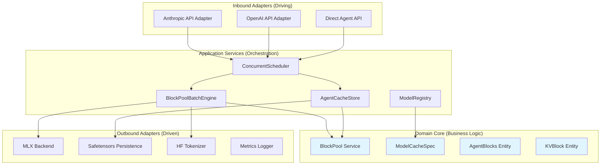
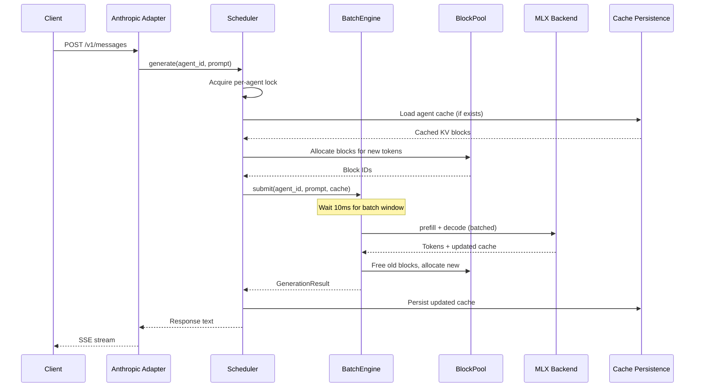
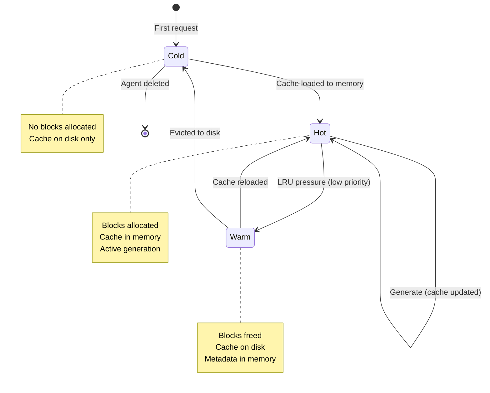
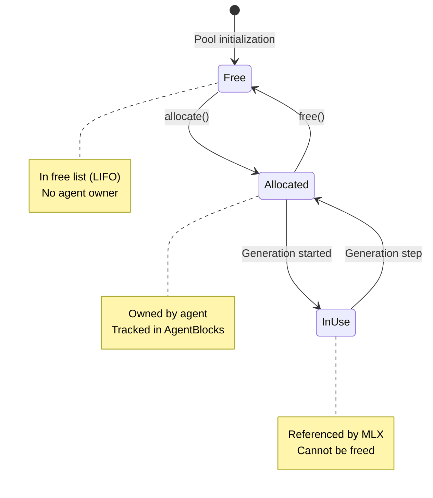
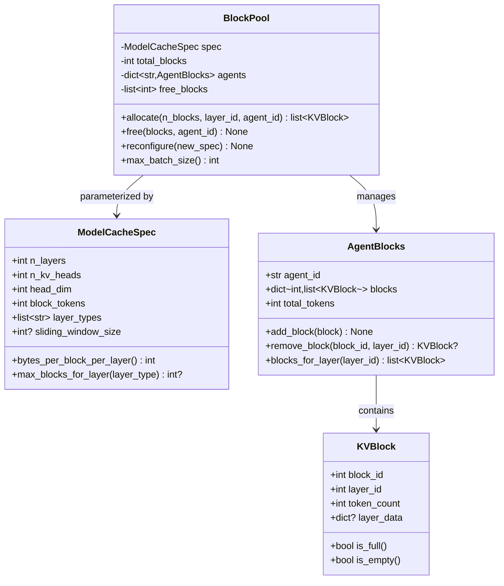
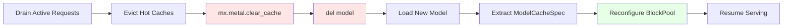

# Architecture Overview

Semantic implements **Hexagonal Architecture** (Ports & Adapters pattern) with **Domain-Driven Design** principles.

## Design Philosophy

### Core Principles

1. **Dependency Rule**: All dependencies point inward toward the domain
2. **Domain Isolation**: Core business logic has zero external dependencies
3. **Ports & Adapters**: Infrastructure concerns isolated at boundaries
4. **Testability**: Easy to test with fakes/mocks at port boundaries

### Why Hexagonal?

- **Evolvability**: Swap MLX for another backend without touching domain
- **Testability**: Unit test domain logic without MLX, FastAPI, or disk I/O
- **Clarity**: Clear separation of "what" (domain) vs "how" (adapters)
- **Future-proof**: Add new protocols (gRPC, WebSocket) without domain changes

## Architecture Layers



**Dependency Direction**: All arrows point toward the domain core (blue).

## Layer Details

### 1. Domain Core (Zero Dependencies)

**Location**: `src/agent_memory/domain/`

**Purpose**: Pure business logic, independent of frameworks.

**Components**:

```python
# Entities (mutable, identity-based)
class AgentBlocks:
    agent_id: str
    blocks: dict[int, list[KVBlock]]  # layer_id -> blocks
    total_tokens: int

    def add_block(self, block: KVBlock) -> None: ...
    def remove_block(self, block_id: int, layer_id: int) -> KVBlock | None: ...

class KVBlock:
    block_id: int
    layer_id: int
    token_count: int  # 0-256
    layer_data: dict[str, Any] | None

    def is_full(self) -> bool: ...
    def is_empty(self) -> bool: ...

# Value Objects (immutable, value-based equality)
@dataclass(frozen=True)
class ModelCacheSpec:
    n_layers: int
    n_kv_heads: int
    head_dim: int
    block_tokens: int = 256
    layer_types: list[str]
    sliding_window_size: int | None = None

    @classmethod
    def from_model(cls, model: Any) -> "ModelCacheSpec": ...
    def bytes_per_block_per_layer(self) -> int: ...

# Domain Services
class BlockPool:
    def __init__(self, spec: ModelCacheSpec, total_blocks: int): ...
    def allocate(self, n_blocks: int, layer_id: int, agent_id: str) -> list[KVBlock]: ...
    def free(self, blocks: list[KVBlock], agent_id: str) -> None: ...
    def reconfigure(self, new_spec: ModelCacheSpec) -> None: ...
```

**Invariants Enforced**:
- `used_blocks + available_blocks = total_blocks` (always)
- `0 <= block.token_count <= 256` (always)
- Block ownership tracked per agent
- Sliding window layers have max blocks cap

**Tests**: 44 unit tests, 3 property-based tests (Hypothesis), 95%+ coverage

### 2. Ports (Interface Definitions)

**Location**: `src/agent_memory/ports/`

**Purpose**: Define contracts between layers.

```python
# Inbound Ports (driving side)
class InferencePort(Protocol):
    def generate(self, agent_id: str, prompt: str, **kwargs) -> GenerationResult: ...

class AgentManagementPort(Protocol):
    def create_agent(self, agent_id: str, system_prompt: str) -> None: ...
    def delete_agent(self, agent_id: str) -> None: ...

# Outbound Ports (driven side)
class ModelBackendPort(Protocol):
    def load_model(self, model_id: str) -> Any: ...
    def prefill(self, tokens: list[int], cache: Any) -> tuple[Any, Any]: ...
    def decode(self, tokens: list[int], cache: Any) -> tuple[Any, Any]: ...

class CachePersistencePort(Protocol):
    def save_cache(self, cache: Any, path: str) -> None: ...
    def load_cache(self, path: str) -> Any: ...
```

### 3. Application Services (Orchestration)

**Location**: `src/agent_memory/application/`

**Purpose**: Coordinate domain objects and ports.

**Key Services**:

**ConcurrentScheduler** (planned):
- Per-agent locks (prevent race conditions)
- 10ms batching window
- Graceful degradation on pool exhaustion

**BlockPoolBatchEngine** (planned):
- Block-based prefill and decode
- Block allocation/extension during generation
- Cache extraction per sequence

**AgentCacheStore** (planned):
- Trie-based prefix matching
- Three-tier eviction (hot/warm/cold)
- LRU policy

**ModelRegistry** (planned):
- Model hot-swap capability
- TTL-based unloading
- ModelCacheSpec extraction

### 4. Adapters

#### Inbound Adapters (API Protocols)

**Location**: `src/agent_memory/adapters/inbound/`

**Purpose**: Translate external requests to domain operations.

**Planned**:
- `anthropic_api.py` — Anthropic Messages API (SSE streaming, tools, thinking)
- `openai_api.py` — OpenAI-compatible + session_id extension
- `direct_api.py` — Direct agent CRUD + stateful generation

#### Outbound Adapters (Infrastructure)

**Location**: `src/agent_memory/adapters/outbound/`

**Purpose**: Implement ports using real infrastructure.

**Planned**:
- `mlx_backend.py` — MLX model loading, prefill, decode, cache extraction
- `safetensors_cache.py` — Disk persistence with atomic writes
- `hf_tokenizer.py` — HuggingFace tokenizer integration
- `metrics.py` — Structured logging and metrics

## Request Flow



## State Machines

### Agent Cache Lifecycle



### Block Lifecycle



## Block Pool Memory Model



## Model Hot-Swap Flow



**Critical Steps**:
1. **Drain**: Wait for in-flight requests to complete
2. **Evict**: Save all hot caches to disk, free blocks
3. **Clear**: `mx.metal.clear_cache()` to reclaim GPU memory
4. **Delete**: `del model` to release Python references
5. **Load**: Load new model from HuggingFace/local
6. **Extract**: Create ModelCacheSpec from new model config
7. **Reconfigure**: Update BlockPool with new spec
8. **Resume**: Accept new requests

**Target**: <30s total latency

## Design Decisions (ADRs)

| ADR | Decision | Rationale |
|-----|----------|-----------|
| ADR-001 | Hexagonal Architecture | Evolvability, testability, clarity |
| ADR-002 | Block Size = 256 Tokens | Universal across all model architectures |
| ADR-004 | Block Gather Strategy | Better memory efficiency than padding |
| ADR-005 | Three-Tier Cache Lifecycle | Balance memory pressure and latency |
| ADR-006 | Multi-Protocol Agent ID | Support content-based + explicit IDs |
| ADR-007 | One Model At A Time | 24GB memory constraint on M4 Pro |

Full ADRs in `project/architecture/` directory.

## Quality Guarantees

- **Domain Coverage**: 95.07% (target: 95%+) ✅
- **Property Tests**: 3 core invariants tested with Hypothesis
- **Type Safety**: mypy --strict (100% type coverage)
- **No External Dependencies**: Domain core imports only from stdlib + domain

## Next Steps

- **Domain Layer**: [Domain entities and services](architecture/domain.md)
- **Application Layer**: [Orchestration services](architecture/application.md)
- **Adapters**: [Infrastructure implementations](architecture/adapters.md)
- **API Reference**: [Complete API docs](api-reference.md)
