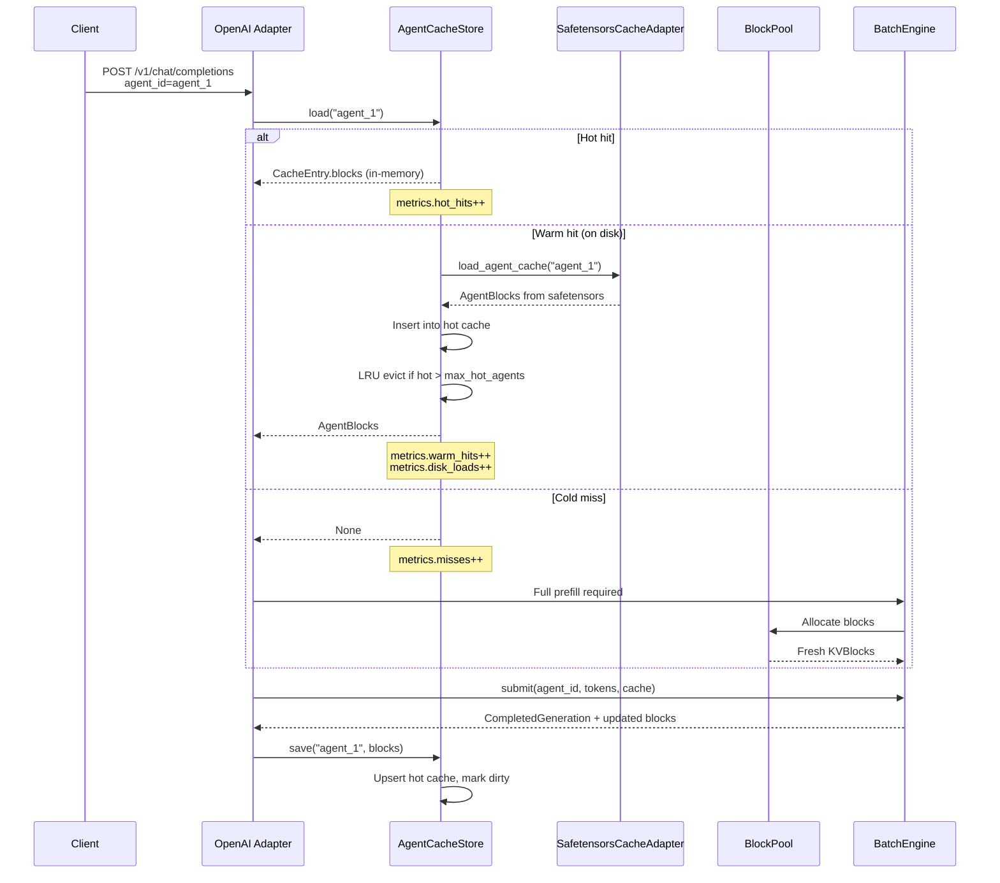
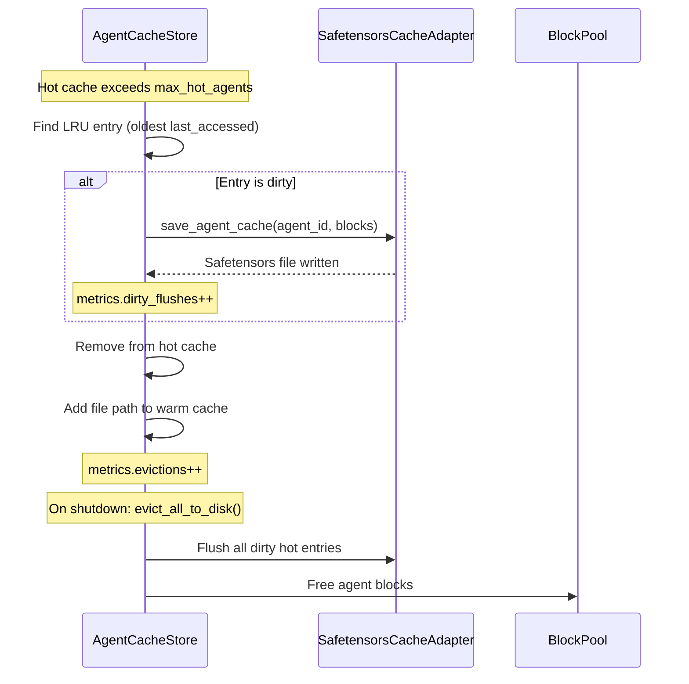
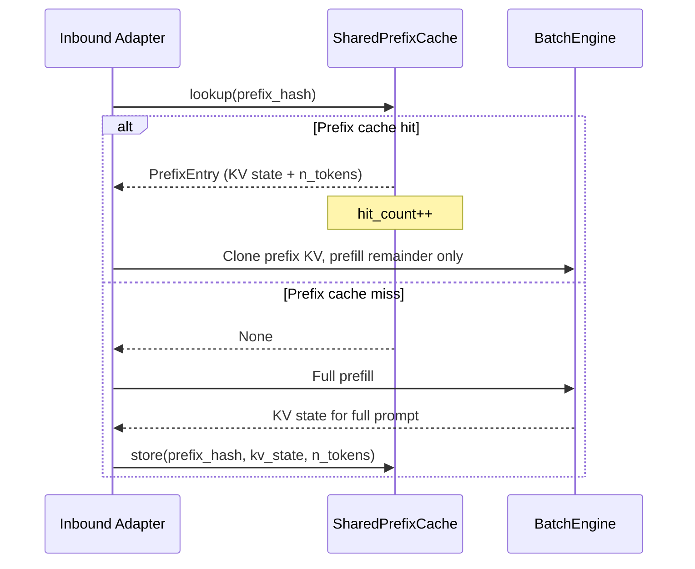

# Cache Lifecycle

The `AgentCacheStore` manages a 3-tier cache hierarchy for per-agent KV
state. Tiers are promoted on access and evicted under memory pressure.

## Tier Definitions

| Tier | Storage | Latency | Contents |
|------|---------|---------|----------|
| Hot | In-memory dict | ~0ms | `CacheEntry` with live `AgentBlocks` |
| Warm | Disk path in dict | ~50-200ms | Safetensors file, metadata in memory |
| Cold | No reference | Full prefill | Agent must be regenerated from scratch |

## Promotion: Cold to Warm to Hot



## Eviction: Hot to Warm to Cold



## Prefix Matching Flow

When a new agent shares the same system prompt as an existing agent, the
`SharedPrefixCache` avoids redundant prefill for the common prefix.



## Disk Format

Cache files are stored as safetensors in `~/.agent_memory/caches/`:

```
{agent_id}.safetensors       — KV cache tensors (Q4 packed uint32)
```

Metadata (stored in safetensors header):
- `model_id`, `n_layers`, `n_kv_heads`, `head_dim` (ModelTag fields)
- `kv_bits`, `kv_group_size` (quantization parameters)
- `v_head_dim` (for MLA asymmetric caches)

Atomic writes use `.tmp.safetensors` intermediary with rename-on-complete.
Orphan `.tmp` files are cleaned on adapter initialization.
