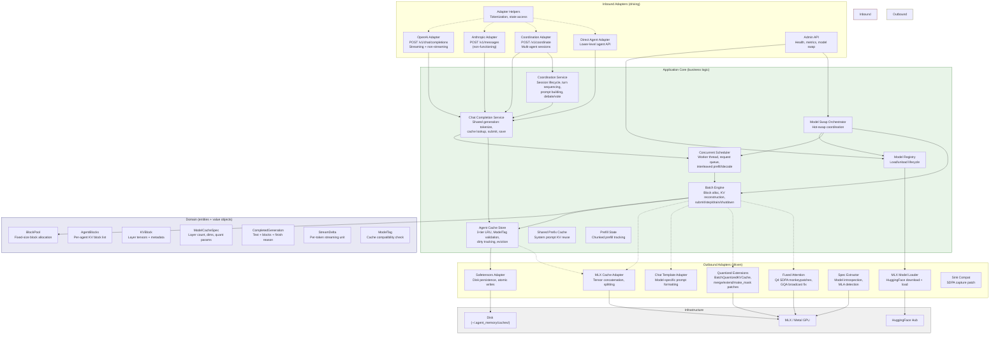

# Hexagonal Architecture

The codebase follows a hexagonal (ports and adapters) architecture. The
application core contains all business logic and depends only on abstract
ports. Inbound adapters translate external protocols into application calls.
Outbound adapters implement infrastructure concerns behind port interfaces.

## Layer Diagram



## Port Interfaces

The application core defines ports (abstract interfaces) that adapters
implement. Key ports:

| Port | Direction | Implementor |
|------|-----------|------------|
| `ChatTemplatePort` | Outbound | `ChatTemplateAdapter` |
| `GenerationEnginePort` | Outbound | `BlockPoolBatchEngine` |
| Cache persistence | Outbound | `SafetensorsCacheAdapter` |
| Cache tensor ops | Outbound | `MLXCacheAdapter` |
| HTTP API | Inbound | OpenAI/Anthropic/Coordination adapters |

## Dependency Rule

Dependencies point inward: adapters depend on the application core, the
application core depends on domain entities and value objects. No domain
object imports from adapters or application services.

```
Inbound Adapters --> Application Core --> Domain <-- Outbound Adapters
                                                         |
                                                    Infrastructure
```

## Package Layout

```
src/agent_memory/
    adapters/
        inbound/        # HTTP adapters, middleware, request models
        outbound/       # MLX, safetensors, chat template adapters
        config/         # Settings, logging
    application/        # Services, scheduler, engine, cache store
    domain/             # Entities, value objects, errors, ports
    entrypoints/        # CLI, FastAPI app factory
```
