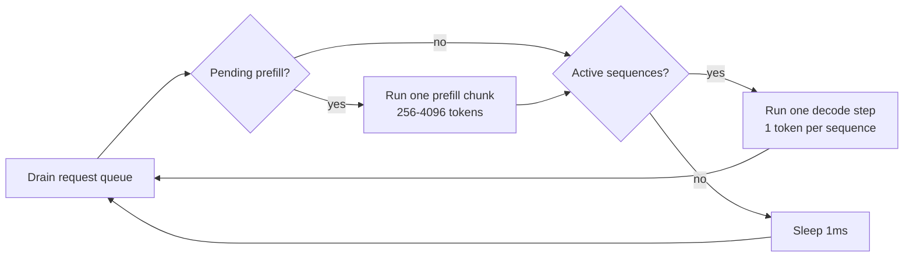

# System Overview

Architecture of the agent-memory inference server. The system provides
OpenAI-compatible and Anthropic-compatible chat completion APIs backed by
MLX on Apple Silicon, with per-agent KV cache persistence and block-pool
memory management.

## Component Diagram

```mermaid
graph TB
    subgraph Inbound Adapters
        OA[OpenAI Adapter<br>/v1/chat/completions]
        AA[Anthropic Adapter<br>/v1/messages]
        CA[Coordination Adapter<br>/v1/coordinate]
        DA[Direct Agent Adapter]
        ADM[Admin API<br>/admin/*]
    end

    subgraph Middleware
        AUTH[Auth Middleware]
        RL[Rate Limiter]
        RM[Request Metrics]
    end

    subgraph Application Core
        CS[Coordination Service<br>Multi-agent orchestration]
        CCS[Chat Completion Service<br>Shared generation logic]
        SCH[Concurrent Scheduler<br>Interleaved prefill/decode]
        BE[Batch Engine<br>Block-pool inference]
        ACS[Agent Cache Store<br>3-tier: hot/warm/cold]
        SPC[Shared Prefix Cache<br>System prompt reuse]
        MR[Model Registry]
        MSO[Model Swap Orchestrator]
    end

    subgraph Domain
        BP[Block Pool<br>O(1) alloc/free]
        AB[Agent Blocks<br>Per-agent KV state]
        KB[KV Blocks<br>Fixed-size tensors]
    end

    subgraph Outbound Adapters
        MCA[MLX Cache Adapter<br>Tensor concat/split]
        SCA[Safetensors Adapter<br>Disk I/O]
        CTA[Chat Template Adapter<br>Model-specific prompts]
        QE[Quantized Extensions<br>BatchQuantizedKVCache]
        FA[Fused Attention<br>Q4 SDPA patch]
        SE[Spec Extractor<br>Model introspection]
        ML[MLX Model Loader]
    end

    subgraph External
        MLX[MLX Runtime<br>Metal GPU]
        DISK[(~/.agent_memory/caches/<br>safetensors files)]
        HF[HuggingFace Hub<br>Model weights]
    end

    OA & AA & CA & DA --> AUTH --> RL --> RM
    RM --> CS & CCS
    ADM --> MR & MSO
    CS --> CCS
    CCS --> SCH
    SCH --> BE
    BE --> BP
    BE --> ACS
    ACS --> SCA
    ACS --> MCA
    BE --> QE & FA
    BE --> CTA
    SPC --> BE
    MR --> ML
    ML --> HF
    MCA --> MLX
    QE --> MLX
    FA --> MLX
    SCA --> DISK
    SE --> MLX
```

## Scheduler Loop

The `ConcurrentScheduler` runs a single daemon thread that interleaves
chunked prefill with per-token decode steps, preventing long prefills
from stalling active generation streams.



## Data Flow Summary

1. HTTP request arrives at an inbound adapter (OpenAI or Anthropic format).
2. Adapter tokenizes the message via `ChatTemplateAdapter`.
3. `AgentCacheStore` looks up existing KV cache (hot, warm, or cold).
4. Request is submitted to the `ConcurrentScheduler`.
5. Scheduler's worker thread runs prefill (if needed) then decode steps.
6. `BatchEngine` allocates blocks from `BlockPool`, runs MLX inference.
7. Generated tokens stream back via SSE or accumulate for batch response.
8. Updated KV cache blocks are saved back to `AgentCacheStore`.

## Thread Model

| Thread | Responsibility |
|--------|---------------|
| asyncio event loop | HTTP request handling, SSE streaming |
| Scheduler worker | All MLX inference (prefill + decode) |
| `mlx_io_lock` | Serializes MLX tensor I/O across threads |
