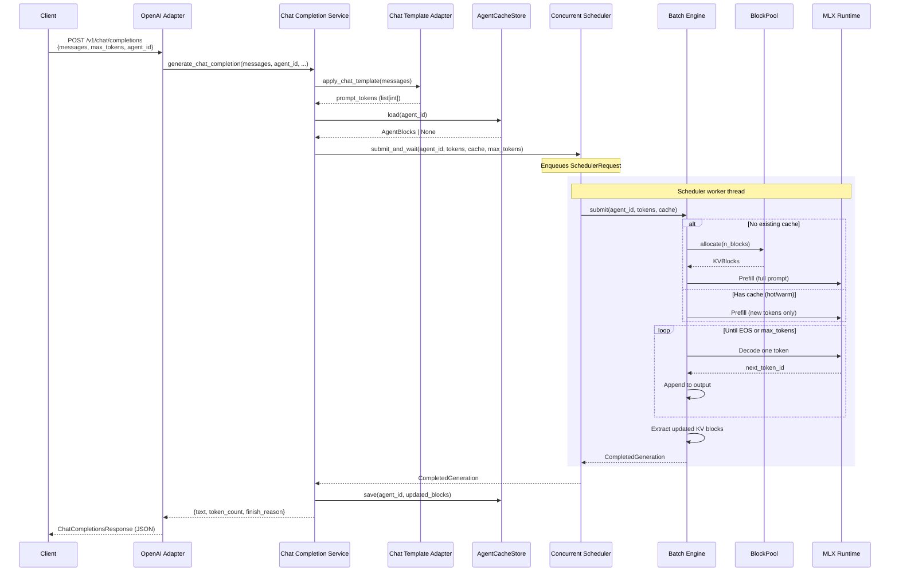
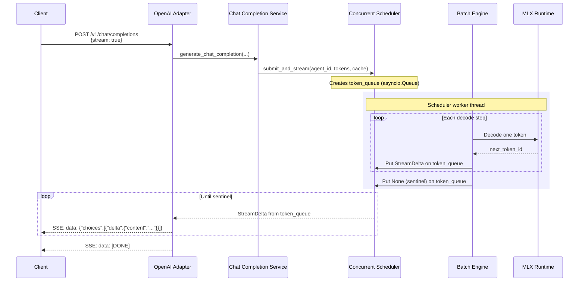
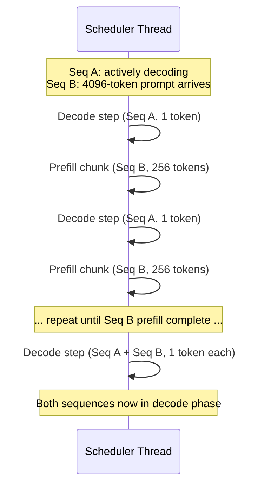

# Request Flow

End-to-end flow for a chat completion request, from HTTP to token generation
and streaming response.

## Non-Streaming Request

## Streaming Request (SSE)

## Scheduler Interleaving

When a long prompt arrives while another sequence is actively decoding,
the scheduler interleaves prefill chunks with decode steps.

## Chunked Prefill Sizing

The `BatchEngine` uses adaptive chunk sizes based on current cache position:

| Cache Position | Chunk Size | Rationale |
|---------------|------------|-----------|
| 0 - 2000 tokens | 4096 | Aggressive: plenty of GPU headroom |
| 2000 - 8000 tokens | 2048 | Moderate: growing memory pressure |
| 8000 - 20000 tokens | 1024 | Conservative: avoid OOM |
| 20000+ tokens | 512 | Minimal: near memory ceiling |
