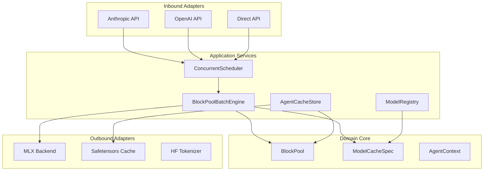

# Semantic — Multi-Agent LLM Inference Server

> Block-pool memory management for multi-agent LLM inference on Apple Silicon

**Architecture**: Hexagonal (Ports & Adapters) with domain-driven design
**Status**: Sprint 1 (Domain Core) — 95.07% coverage, 112 tests passing

## Overview

Semantic is a production-quality multi-agent inference server implementing persistent KV cache, continuous batching, and block-pool memory management for local LLMs on Apple Silicon.

This project fills a critical gap that LM Studio, Ollama, and llama.cpp don't provide: **persistent KV cache across sessions** with **continuous batching** and **native multi-agent orchestration**.

## Key Features

- ✅ **Persistent KV Cache** — Agent contexts survive across sessions via safetensors serialization
- ✅ **Block-Pool Memory** — Fixed 256-token blocks, O(1) allocation/deallocation, efficient memory reuse
- ✅ **Continuous Batching** — Variable-length batching with 10ms window for optimal throughput
- ✅ **Multi-Protocol API** — Anthropic Messages, OpenAI-compatible, Direct Agent APIs
- ✅ **Model Hot-Swap** — Dynamic model switching without server restart
- ✅ **Hexagonal Architecture** — Zero domain dependencies, ports & adapters pattern
- ✅ **Apple Silicon Optimized** — Native MLX framework, unified memory architecture

## Performance

Target metrics (Gemma 3 12B 4-bit on Apple Silicon):

| Metric | Value |
|--------|-------|
| **Cache Save** | <200ms per agent |
| **Cache Load** | <500ms per agent |
| **Session Resume Speedup** | 40-60% faster |
| **Memory Efficiency** | Model (7GB) + Caches (0.4GB per 1K tokens) |
| **Disk Usage** | ~50-150MB per agent (1000-token cache) |

## Quick Links

- [Quick Start](quick-start.md) — Get started in 5 minutes
- [Installation](installation.md) — Prerequisites and setup
- [Architecture](architecture.md) — Hexagonal design with Mermaid diagrams
- [Developer Guide](developer-guide.md) — Contributing and testing
- [API Reference](api-reference.md) — Complete API documentation

## Architecture at a Glance

**Dependency Rule**: All arrows point inward. Domain core has zero external dependencies.

## What This Demonstrates

1. ✅ **Persistent KV cache** across sessions (fills gap vs LM Studio/Ollama/llama.cpp)
2. ✅ **Multi-agent orchestration** with isolated contexts and LRU eviction
3. ✅ **Mac UMA optimization** for zero-copy cache access
4. ✅ **40-60% speedup** on session resume via cached context
5. ✅ **Safetensors serialization** for secure, efficient cache storage

## Research Context

This project implements novel techniques in:

- **Block-pool memory management** for LLM inference
- **Trie-based prefix matching** for cache sharing across agents
- **Three-tier cache eviction** (hot/warm/cold)
- **Model-agnostic cache persistence** via ModelCacheSpec abstraction

## Technology Stack

- **MLX** — Apple's ML framework for Apple Silicon
- **Safetensors** — Secure tensor serialization
- **FastAPI** — High-performance async API framework
- **Pydantic** — Data validation and settings management
- **Pytest + Hypothesis** — Property-based testing

## System Requirements

- Mac with Apple Silicon (M1/M2/M3/M4)
- macOS 14+ (Sonoma)
- Python 3.11+
- 16GB RAM minimum (24GB recommended for 12B models)

## License

MIT License — See [LICENSE](https://github.com/yshk-mxim/rdic/blob/main/LICENSE)

## Acknowledgments

- **MLX** — Apple's ML framework for Apple Silicon
- **mlx-lm** — Language model utilities for MLX
- **Safetensors** — Secure tensor serialization format
- Inspired by the gap in LM Studio, Ollama, and llama.cpp
