# Agent Memory Below the Prompt

## Persistent KV Cache as Working Memory for Multi-Agent LLM Inference on Edge Devices

**February 2026** | Technical Write-Up

---

## Abstract

Multi-agent LLM workflows on edge devices suffer from *O(n)* cold-start latency: every agent turn re-prefills the entire conversation history from scratch. On Apple Silicon, where GPU compute is 10--50x slower than datacenter accelerators, this means 8--40 seconds of prefill per turn — rendering multi-agent workflows unusably slow. We present **Semantic**, a persistent KV cache management system that addresses this through two key ideas: (1) a **persistent block pool** that gives each agent its own isolated, quantized (Q4) KV cache persisted to disk in safetensors format, and (2) **KV cache as working memory** — a paradigm shift from RAG-style text retrieval to persistent attention-layer state that agents carry across sessions and phases. The system achieves **2.0x--4.3x end-to-end speedup** on multi-turn conversations (up to **81.6x TTFT speedup** at 16K context with hot in-memory cache; **1.1--2.0x** with disk-reloaded cache after server restart), **72% memory savings** from end-to-end Q4 operation, and supports **4 model architectures** (Gemma 3, GPT-OSS, Llama 3.1, Qwen 2.5) through a model-agnostic block pool abstraction. A novel **BatchQuantizedKVCache** enables concurrent inference over multiple agents' Q4 caches — a capability absent from upstream MLX libraries — with an interleaved prefill+decode scheduler that provides true per-token streaming during batched generation. Multi-phase coordination scenarios (prisoner's dilemma, gossip networks) demonstrate that persistent KV cache serves as a functional working memory: agents maintain attention-layer state across phases, eliminating re-computation and enabling context that accumulates rather than re-computes. To our knowledge, this is the first system combining agent-isolated persistent Q4 KV cache management on Apple Silicon's Unified Memory Architecture with batched quantized inference and cross-phase working memory semantics.

---

## Table of Contents

1. [Introduction](#1-introduction)
2. [Background & Motivation](#2-background--motivation)
3. [System Design](#3-system-design)
4. [Implementation](#4-implementation)
5. [Evaluation](#5-evaluation)
6. [Discussion](#6-discussion)
7. [Related Work](#7-related-work)
8. [Conclusion](#8-conclusion)

---

## 1. Introduction

### 1.1 The Multi-Agent Cold-Start Problem

Modern LLM agent workflows — code assistants, multi-persona debates, collaborative analysis — involve multiple agents maintaining independent conversation histories. Each agent accumulates a system prompt, conversation turns, and context that may span thousands of tokens. When an agent resumes after any interruption (server restart, model swap, or session timeout), the entire conversation must be re-processed from scratch through the model's prefill phase.

On datacenter GPUs (NVIDIA A100, ~10,000 tokens/second prefill), a 4K-token re-prefill takes ~400ms — tolerable. On Apple Silicon (M4 Pro, ~500 tokens/second prefill), the same re-prefill takes **~8 seconds**. For a 5-agent workflow where each agent has accumulated 4K tokens of context, a server restart costs **40 seconds of re-prefill** before any agent can respond.

### 1.2 The Key Insight

The KV (key-value) cache produced during prefill *is* the agent's memory at the attention layer. Rather than discarding it after each request (as serving engines do) or keeping it only in volatile RAM (as local tools do), we can **persist it to disk in quantized form** and **reload it in milliseconds**. This transforms agent context restoration from a compute-bound operation (*O(n)* in sequence length) to an I/O-bound operation (~5--80ms depending on cache size).

### 1.3 From RAG to Working Memory

Current approaches to giving LLM agents persistent context rely on **retrieval-augmented generation (RAG)**: text chunks are stored in vector databases, retrieved by similarity, and stuffed into the context window as plain text. Every request re-computes attention over the retrieved text from scratch. The KV cache produced during this computation is discarded.

We propose an alternative: **KV cache as working memory**. Instead of retrieving text and re-computing attention, agents maintain their computed attention state — the KV cache — as a persistent, reusable artifact. This is analogous to how human working memory retains processed information rather than re-reading source material on each cognitive step.

The distinction is fundamental:

| Property | RAG (text retrieval) | KV Cache as Working Memory |
|----------|---------------------|---------------------------|
| Storage unit | Text chunks + embeddings | Attention-layer state (KV pairs) |
| On each request | Re-prefill over retrieved text | Reload computed attention state |
| Latency per request | *O(n)* in context length | *O(1)* cache load (~50ms) |
| Cross-session persistence | Embedding database survives | KV cache survives (safetensors) |
| Agent isolation | Per-user embedding partitions | Per-agent cache namespaces |
| Memory level | Above the prompt (text) | Below the prompt (attention) |

Multi-phase coordination scenarios demonstrate this concretely: in a prisoner's dilemma with 5 phases, agents carry attention-layer state from interrogation through yard conversation through final reckoning — each phase extends the cached prefix rather than re-computing from scratch.

### 1.4 Contributions

This system makes six contributions:

1. **Persistent Block Pool with Per-Agent Isolation** — A model-agnostic block pool that gives each agent its own namespaced, persistent Q4 KV cache surviving server restarts, model swaps, and device reboots.

2. **BatchQuantizedKVCache with Interleaved Scheduling** — A batched inference mechanism over Q4-quantized KV caches (no public MLX implementation exists), with `merge()`/`extract()` operations that bridge per-agent persistence and concurrent generation, plus a `ConcurrentScheduler` providing per-token decode granularity and true SSE streaming during batched inference.

3. **KV Cache as Working Memory** — A paradigm for multi-agent coordination where persistent KV caches serve as agent working memory across phases, replacing text-retrieval-based context with pre-computed attention state.

4. **Q4 End-to-End Persistence Pipeline** — A cache lifecycle where KV data stays in 4-bit quantized format from disk through inference, using MLX's `quantized_scaled_dot_product_attention()` without format conversion.

5. **Character-Level Prefix Matching** — A BPE-immune cache reuse mechanism that compares raw prompt text instead of token IDs, eliminating false cache misses caused by tokenizer non-compositionality across sessions.

6. **UMA-Aware Memory Management** — Adaptive chunked prefill with MLX lazy evaluation discipline, co-designed for Apple Silicon's unified memory constraints.

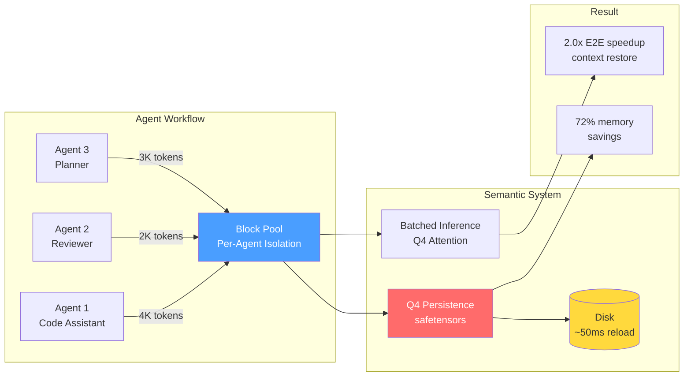

---

## 2. Background & Motivation

### 2.1 The Re-Prefill Problem in Multi-Agent Workflows

Agent frameworks (AutoGen, CrewAI, LangGraph) orchestrate multiple LLM-powered agents that maintain independent conversation histories. These frameworks operate at the **message level** — they manage text prompts and responses. None of them are aware of the **KV cache** that the underlying inference engine produces during each forward pass.

This means every time an agent sends a new message, the inference engine must re-process the agent's entire conversation history through the model's attention layers. The KV cache from the previous turn is either discarded (stateless serving) or lost (server restart).

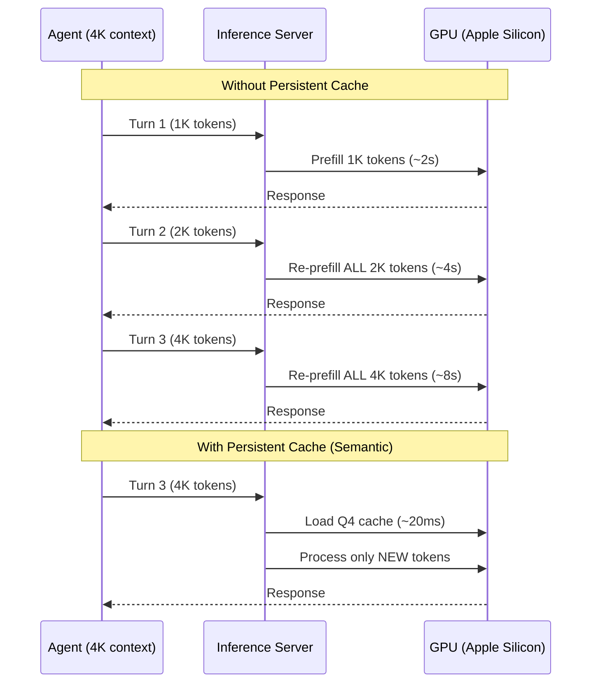

### 2.2 Apple Silicon UMA: Opportunities and Constraints

Apple Silicon uses a **Unified Memory Architecture (UMA)** where CPU and GPU share the same physical DRAM. This fundamentally changes the optimization landscape compared to datacenter inference:

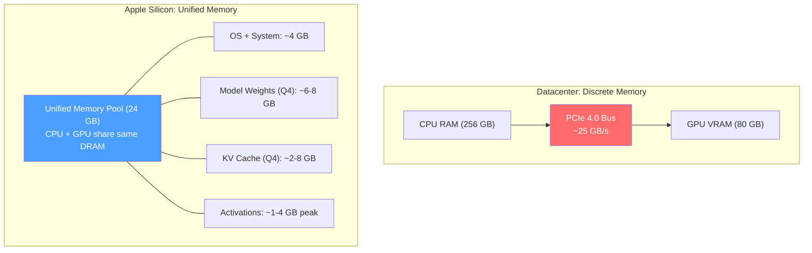

| Property | Datacenter (A100) | Apple Silicon (M4 Pro) | Design Impact |
|----------|-------------------|------------------------|---------------|
| Memory capacity | 80 GB VRAM + 256 GB RAM | 24 GB shared | Q4 quantization is **mandatory**, not optional |
| Transfer cost | ~25 GB/s PCIe | Zero (same DRAM) | Disk persistence is viable — no host-to-device copy |
| Prefill speed | ~10,000 tok/s | ~500 tok/s | Cache reuse saves **10-50x** more wall time |
| Peak memory | VRAM-isolated | Shared with OS | Chunked prefill prevents system-wide pressure |
| Fragmentation | PagedAttention | MLX buffer cache | Block pool + `mx.clear_cache()` discipline |

**The compute asymmetry is the key motivator.** On an A100, re-prefilling 4K tokens takes ~400ms — persistence saves marginal time. On Apple Silicon, the same re-prefill takes ~8 seconds — persistence transforms the interaction model.

MLX further enables this through **CPU-GPU stream-level parallelism**: the CPU can prepare the next chunk's computation graph while the GPU executes the current chunk. Combined with lazy evaluation, this enables overlapped cache loading and computation that benchmarks at ~21% latency improvement and ~26% throughput increase over serial execution.

### 2.3 Why Existing Solutions Fall Short

No existing system occupies the design point that edge multi-agent inference requires:

| System | Persistent Cache | Per-Agent Isolation | Q4 KV Cache | Edge/UMA Aware | Working Memory | Q4 Batching |
|--------|:---:|:---:|:---:|:---:|:---:|:---:|
| vLLM | - | - | - | - | - | - |
| vllm-mlx (Barrios 2026) | - | - | - | Partial | - | FP16 batch |
| SGLang | - | - | - | - | - | - |
| LMCache | Disk + S3 | - | - | - | - | - |
| RAG-DCache (Lee 2025) | Disk | - | - | - | Document-level | - |
| llama.cpp | Slot API | Shared context | FP16 only | Partial | - | - |
| LM Studio | - | - | - | MLX support | - | - |
| Ollama | - | - | - | Metal support | - | - |
| mlx-lm (upstream) | - | - | Q4 single | - | - | FP16 only |
| **Semantic (this work)** | **safetensors** | **Block pool** | **End-to-end** | **UMA co-designed** | **Cross-phase** | **Q4 batch** |

### 2.4 KV Cache as Agent Working Memory

Recent research has begun recognizing the KV cache as a memory substrate:

- **MemArt** (OpenReview, Oct 2025) stores conversational turns as reusable KV cache blocks, retrieving via attention scores. Reports 11% accuracy improvement over plaintext memory and 91--135x fewer prefill tokens.
- **Memory³** and **MemOS** make the KV cache an explicit memory carrier, encoding external knowledge as sparse KV pairs injected into attention layers.
- **EM-LLM** (ICLR 2025) implements episodic memory via KV-pair retrieval, outperforming traditional RAG by 30.5% on LongBench.

These systems validate the principle that KV cache is a more efficient memory format than text. However, none of them combine:
1. **Disk persistence** (survive process restarts)
2. **Per-agent isolation** (each agent owns its cache)
3. **Q4 quantization** (fit in edge memory budgets)
4. **Cross-phase coordination** (carry working memory across multi-step workflows)

Semantic occupies this intersection.

---

## 3. System Design

### 3.1 Block Pool Architecture (Core Contribution)

The block pool is the central abstraction. Each agent owns a set of **256-token blocks** organized by layer, persisted to disk as Q4 safetensors files, and reloaded into MLX's `QuantizedKVCache` for inference.

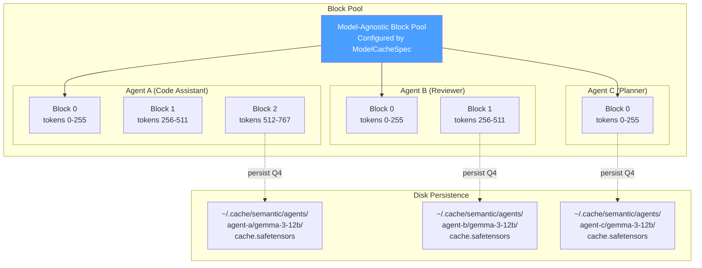

**Per-agent namespacing and isolation semantics.** Each agent's cache is identified by `(agent_id, model_id)`. Agent A cannot read or corrupt Agent B's cache. Caches are persisted independently — Agent A's cache can be on disk while Agent B's is hot in memory.

**Model-agnostic cache specification.** Different model architectures have radically different KV cache geometries:

| Model | Layers | KV Heads | Head Dim | Attention Pattern | KB/token |
|-------|--------|----------|----------|-------------------|----------|
| Gemma 3 12B | 48 | 4 | 256 | 8 full + 40 SWA(512) | 64 |
| GPT-OSS 20B | 24 | 8 | 64 | 12 full + 12 SWA(128) | 48 |
| Llama 3.1 8B | 32 | 8 | 128 | 32 full (uniform) | 128 |
| Qwen 2.5 14B | 48 | 8 | 128 | 48 full (uniform) | 192 |

A `ModelCacheSpec` dataclass captures each model's geometry. The block pool reconfigures at model-swap time — the same pool logic serves any architecture:

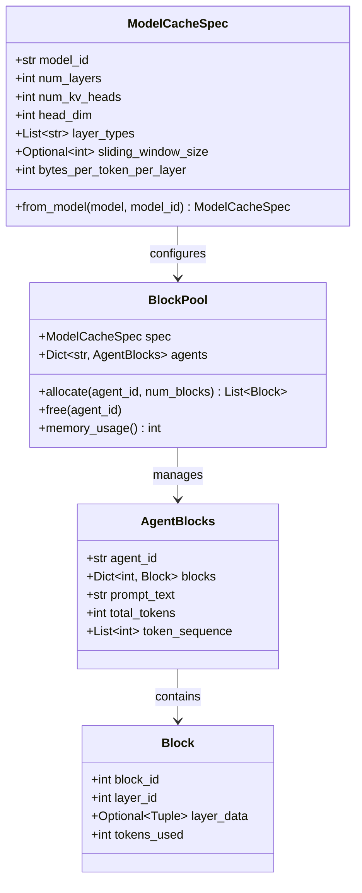

**Concurrency model: per-agent sequential, cross-agent parallel.** Requests to the same agent execute sequentially (via `asyncio.Lock` per agent_id) to maintain cache consistency. Requests to different agents execute in parallel via MLX's `BatchGenerator`. This ensures Agent A's Turn 2 always sees the updated cache from Turn 1, while Agent B's concurrent request runs in the same GPU batch.

### 3.2 Q4 Persistence Pipeline

The KV cache stays in 4-bit quantized format through its entire lifecycle — from disk through inference — with zero format conversion:

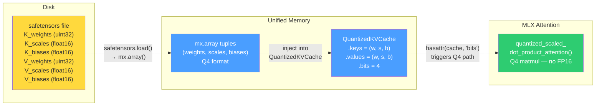

**Quantization format.** MLX `QuantizedKVCache` stores tensors as:
- **Weights**: `uint32` packed arrays (8 values per uint32 at 4-bit)
- **Scales**: `float16` per group (group_size=64)
- **Biases**: `float16` per group

**Memory formula** (per layer, per K or V):
```
Q4_bytes = (seq_len x n_heads x head_dim x 0.5)          # weights: 4-bit = 0.5 bytes
         + (seq_len x n_heads x head_dim / 64 x 2 x 2)    # scales + biases: float16
```

**MLX routing mechanism.** MLX dispatches attention based on cache type:

```python
if hasattr(cache, "bits"):    # QuantizedKVCache -> Q4 path
    quantized_scaled_dot_product_attention(queries, *keys, *values, ...)
else:                          # Regular KVCache -> FP16 path
    mx.fast.scaled_dot_product_attention(queries, keys, values, ...)
```

By injecting `QuantizedKVCache` (which has `.bits`), we force the Q4 attention path that uses `mx.quantized_matmul` internally — operating directly on packed uint32 weights without creating FP16 intermediates.

**Measured memory savings:**

| Tokens | Q4 Cache | FP16 Cache | Savings |
|--------|----------|------------|---------|
| 500 | 0.036 GB | 0.129 GB | 72% |
| 1,000 | 0.073 GB | 0.258 GB | 72% |
| 2,000 | 0.145 GB | 0.515 GB | 72% |
| 4,000 | 0.290 GB | 1.030 GB | 72% |

**Context capacity impact (M4 Pro, 24GB):** ~35,000 tokens with Q4 vs. ~17,000 tokens with FP16 — a **2x capacity increase**.

**Attention sink compatibility.** Models using attention sinks (e.g., GPT-OSS 20B) are incompatible with MLX's quantized SDPA kernel. We implement a fallback that dequantizes Q4 to FP16 *transiently during attention compute only*, then frees the temporary. KV cache storage remains Q4. The transient FP16 allocation exists for ~milliseconds per forward pass, preserving ~70% net memory savings.

### 3.3 Character-Level Prefix Matching

BPE tokenization is **non-compositional**: `tokenize(A + B) != tokenize(A) + tokenize(B)`. When an agent's prompt grows between turns (new messages appended), the token IDs for previously-cached content *change* due to shifted merge boundaries. Token-level prefix matching — used by vLLM, SGLang, and llama.cpp — fails at these boundaries, discarding valid caches.

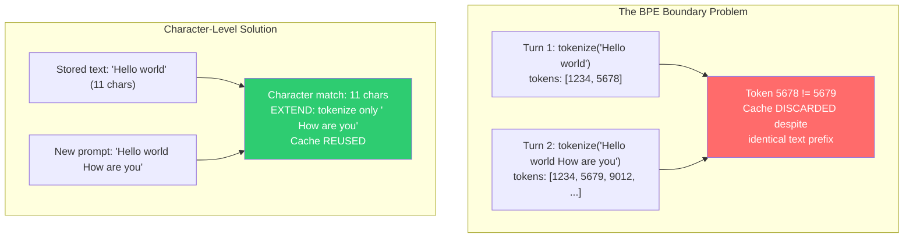

**Three match outcomes:**

| Outcome | Condition | Action |
|---------|-----------|--------|
| **EXACT** | Match covers entire stored *and* new prompt | Skip prefill (same prompt = biased output) |
| **EXTEND** | Match covers entire stored, new is longer | Reuse full cache, tokenize only new suffix |
| **DIVERGE** | Match < stored length | If >= 80% matched: trim cache, process remainder. Else: discard |

The character-level approach is particularly critical for the cross-phase working memory use case: when a phase's prompt template injects prior-phase messages as a prefix, the raw text prefix is identical to what produced the cached KV — guaranteeing an EXTEND match even though BPE tokenization of the concatenated result differs from the original.

### 3.4 UMA Memory Management

#### Adaptive Chunked Prefill

MLX uses **lazy evaluation** — operations build a computation graph that executes only when `mx.eval()` is called. Without explicit evaluation between chunks, intermediate attention matrices from *all* chunks accumulate in unified memory before any are released:

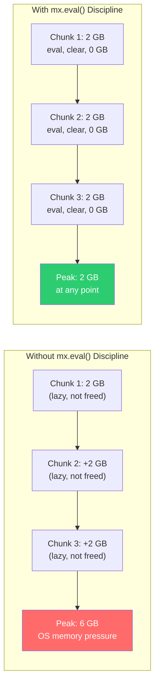

**Adaptive chunk sizing:** Larger chunks early (when accumulated cache is small), smaller chunks later (when cache is large):

| Cache Position | Chunk Size | Rationale |
|----------------|-----------|-----------|
| < 2,000 | 4,096 | Small cache, small attention matrix |
| 2,000 - 8,000 | 2,048 | Medium cache |
| 8,000 - 20,000 | 1,024 | Large cache |
| > 20,000 | 512 | Very large cache, conservative |

**Measured impact:**

| Tokens | Without Chunking | With Adaptive Chunks | Reduction |
|--------|-----------------|---------------------|-----------|
| 20K | 15.0 GB (OOM risk) | 3.52 GB | 77% |
| 40K | OOM | 5.08 GB | Works |
| 50K | OOM | 7.06 GB | Works |

**Combined with Q4 KV cache:** Adaptive chunking + Q4 extends context capacity from ~20K to **80K+ tokens** on 24GB systems.

#### Three-Step Memory Reclamation

```python
# 1. Materialize lazy computation graph
mx.eval(output_tensor)

# 2. Release MLX's Metal buffer pool
mx.clear_cache()

# 3. Release Python references + garbage collect
del temporary_tensors
gc.collect()
```

All three steps are required on MLX/UMA. Skipping any one leaves memory unreclaimable through a different mechanism.

### 3.5 Cross-Phase Context Injection

The working memory contribution is realized through a **cross-phase context injection** mechanism that constructs prompts so their prefix matches the agent's cached KV state.

**YAML-driven phase definitions.** Multi-agent scenarios are specified declaratively:

```yaml
# Gossip Network: 3 phases, 3 agents
phases:
  - name: alice_bob
    label: "Phase 1: Alice & Bob (Private)"
    agents: [alice, bob]
    auto_rounds: 3

  - name: alice_eve
    label: "Phase 2: Alice & Eve (Private)"
    agents: [alice, eve]
    auto_rounds: 3

  - name: reunion
    label: "Phase 3: The Reunion"
    agents: [alice, bob, eve]
    per_agent_prompt_templates:
      alice: |
        YOUR PRIVATE MEMORIES (only you can see this):
        From your private chat with Bob:
        ${alice_bob.messages[alice]}
        From your private chat with Eve:
        ${alice_eve.messages[alice]}
```

**Template resolution.** The `${phase_name.messages[agent_key]}` pattern resolves at phase creation time, substituting formatted transcripts from prior phases with perspective-aware formatting (the target agent's messages are labeled "You"):

```python
_TEMPLATE_PATTERN = re.compile(r"\$\{(\w+)\.messages\[(\w+)\]\}")

def resolve_template(template, phase_messages, agent_display_names):
    def _replacer(match):
        phase_name = match.group(1)
        agent_key = match.group(2)
        messages = phase_messages.get(phase_name, [])
        perspective_name = agent_display_names.get(agent_key)
        return _format_transcript(messages, perspective_name)
    return _TEMPLATE_PATTERN.sub(_replacer, template)
```

**Persistent cache key resolution.** Permanent agents in multi-phase scenarios get identity-based cache keys that survive session deletion:

```python
def _resolve_cache_key(self, session_id, agent_id):
    session = self._sessions.get(session_id)
    if session and session.persistent_cache_prefix:
        agent_role = session.agents.get(agent_id)
        if agent_role and agent_role.lifecycle == AgentLifecycle.PERMANENT:
            return f"persist_{session.persistent_cache_prefix}_{agent_id}"
    return f"coord_{session_id}_{agent_id}"
```

**Prior message injection.** When creating a new phase session, messages from prior phases where the agent participated are injected into the channel with `visible_to` scoping (hidden from API responses but included in prompt building). This ensures the prompt in Phase N starts with the same token sequence as the prompt in Phase N-1 — triggering the EXTEND path of character-level prefix matching and reusing the cached KV state.

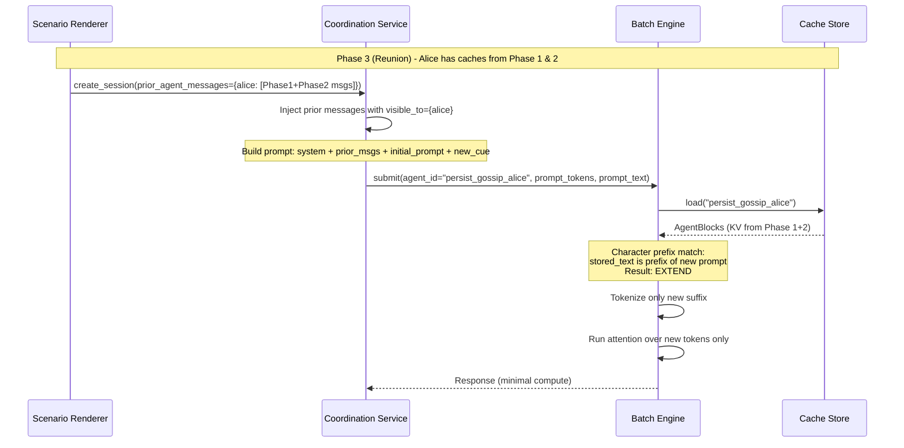

### 3.6 Continuous Batching with Persistent Q4 Caches

The system implements continuous batching with a novel constraint: each sequence in the batch carries its own persistent Q4 KV cache. This is a capability that no existing MLX inference system provides — upstream `mlx-lm` supports `BatchKVCache` for concurrent FP16 generation, but has no mechanism for merging, persisting, or restoring quantized caches within a batch. Issue #548 on the mlx-lm repository explicitly requests persistent batch KV cache; the maintainers acknowledged it as "not unreasonable" but it remains unimplemented.

#### BatchQuantizedKVCache

The `BatchQuantizedKVCache` class extends MLX's cache hierarchy to support batched inference over Q4-quantized KV pairs. Three operations make this possible:

**merge()** — Combines per-agent Q4 caches into a single batched tensor. When agents A and B submit concurrent requests, each with a pre-existing Q4 cache of different lengths, `merge()` left-pads shorter caches to align sequence positions and stacks them into `(batch, heads, max_len, dim)` tensors. The merge operates directly on Q4-packed `uint32` weights, `float16` scales, and `float16` biases — no dequantization to FP16 occurs.

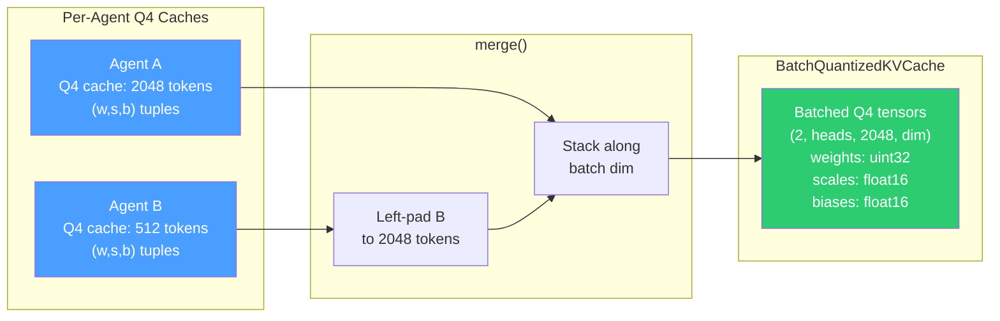

**update_and_fetch()** — Appends new tokens to the growing batch cache by quantizing them on-the-fly. During generation, each new K/V pair is quantized to Q4 using `mx.quantize(group_size=64, bits=4)` and appended to a dynamically expanding buffer (step size: 256 tokens). The lazy evaluation discipline is maintained — no `mx.eval()` is called within this method, allowing MLX to fuse quantization with the next attention computation.

**extract()** — Pulls a single sequence from the batch after generation completes. The extracted Q4 cache is materialized (via `mx.eval()` to detach from the batch tensor) and returned as a standalone `QuantizedKVCache` for persistence to disk. This is the bridge between batched inference and per-agent storage: after batched generation, each agent's updated cache is extracted and persisted independently.

#### Monkey-Patching Upstream mlx-lm

Three targeted patches bridge the gap between upstream `mlx-lm` (which knows nothing about Q4 batching) and the persistence layer:

| Patch | Target | Effect |
|-------|--------|--------|
| `QuantizedKVCache.merge()` | `mlx_lm.models` | Routes to `BatchQuantizedKVCache.merge()` instead of failing |
| `BatchKVCache.merge()` | `mlx_lm.generate` | Detects Q4 inputs (tuple with 3 components) and delegates |
| `_make_cache()` | `mlx_lm.generate` | Creates `BatchQuantizedKVCache` instead of `BatchKVCache` when Q4 is active |

These patches are applied at import time and total ~130 lines. They represent the minimal surface area needed to make upstream batching infrastructure Q4-aware without forking the library.

#### Interleaved Prefill + Decode Scheduling

The `ConcurrentScheduler` interleaves chunked prefill with per-token decode, enabling true streaming responses while long prompts are being processed:

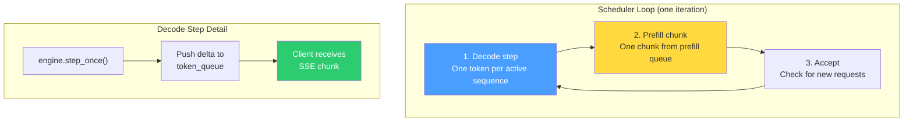

**Per-token decode granularity.** The engine exposes `step_once()` — a method that generates exactly one token per active sequence per call, returning `StepOneResult` rather than running to completion. This is distinct from upstream `mlx-lm`'s `step()` which exhausts all sequences to their `max_tokens` limit. Per-token granularity enables:

1. **True SSE streaming** — Each token is pushed to an `asyncio.Queue` and yielded to the client as an SSE chunk within milliseconds of generation.
2. **Responsive interleaving** — Between decode steps, the scheduler processes one prefill chunk from the prefill queue. Long prompts (32K tokens) are chunked adaptively (4096→512 tokens based on cache position) and interleaved with decode steps for already-active sequences.
3. **Fair scheduling** — The prefill queue rotates round-robin after each chunk, preventing a single long prompt from starving shorter ones.

**Warm cache fast path.** When a request arrives with a pre-existing cache (`req.cache is not None`), the scheduler bypasses the prefill queue entirely and submits directly to the decode phase. This means warm cache hits experience no prefill latency — only the new suffix tokens (typically a single user message) are processed before streaming begins.

#### Cache Lifecycle in Batched Inference

The full lifecycle of a Q4 cache through batched inference:

```
Agent requests arrive → Load Q4 caches from disk (per-agent safetensors)
    → merge() into BatchQuantizedKVCache (left-pad alignment)
    → Batched generation via step_once() (Q4 update_and_fetch per token)
    → extract() per-agent cache from batch
    → Quantize any float layers to Q4
    → Persist to disk (per-agent safetensors)
```

The cache extraction pipeline uses a single batched `mx.eval()` call across all layers (instead of per-layer evaluation), reducing GPU synchronization overhead by ~20x. On a 48-layer model like Gemma 3 12B, this saves 100--500ms per cache persistence operation.

---

## 4. Implementation

### 4.1 Architecture

The system follows **hexagonal architecture** (ports and adapters), ensuring infrastructure concerns (MLX, safetensors, FastAPI) are isolated from domain logic:

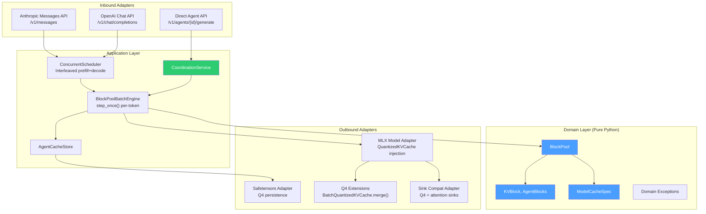

**Layer boundaries:**

| Layer | Location | Can Import | Cannot Import |
|-------|----------|------------|---------------|
| **Domain** | `src/semantic/domain/` | stdlib only | mlx, fastapi, safetensors, numpy |
| **Application** | `src/semantic/application/` | domain, ports | mlx, fastapi, safetensors |
| **Ports** | `src/semantic/ports/` | domain, typing | Any infrastructure |
| **Adapters** | `src/semantic/adapters/` | Everything | -- |

### 4.2 Supported Models

| Model | Parameters | Active Params | Architecture | KV Cache Pattern |
|-------|-----------|---------------|--------------|-----------------|
| Gemma 3 12B (Q4) | 12B | 12B (dense) | Hybrid GQA + SWA | 8 full + 40 sliding(512) |
| GPT-OSS 20B (MXFP4) | 20B | 3.6B (sparse MoE) | Hybrid + sinks | 12 full + 12 sliding(128) |
| Llama 3.1 8B (Q4) | 8B | 8B (dense) | Uniform GQA | 32 full attention |
| Qwen 2.5 14B (Q4) | 14B | 14B (dense) | Uniform GQA + bias | 48 full attention |

### 4.3 Data Flow: Agent Resume

The complete flow when an agent resumes a conversation:

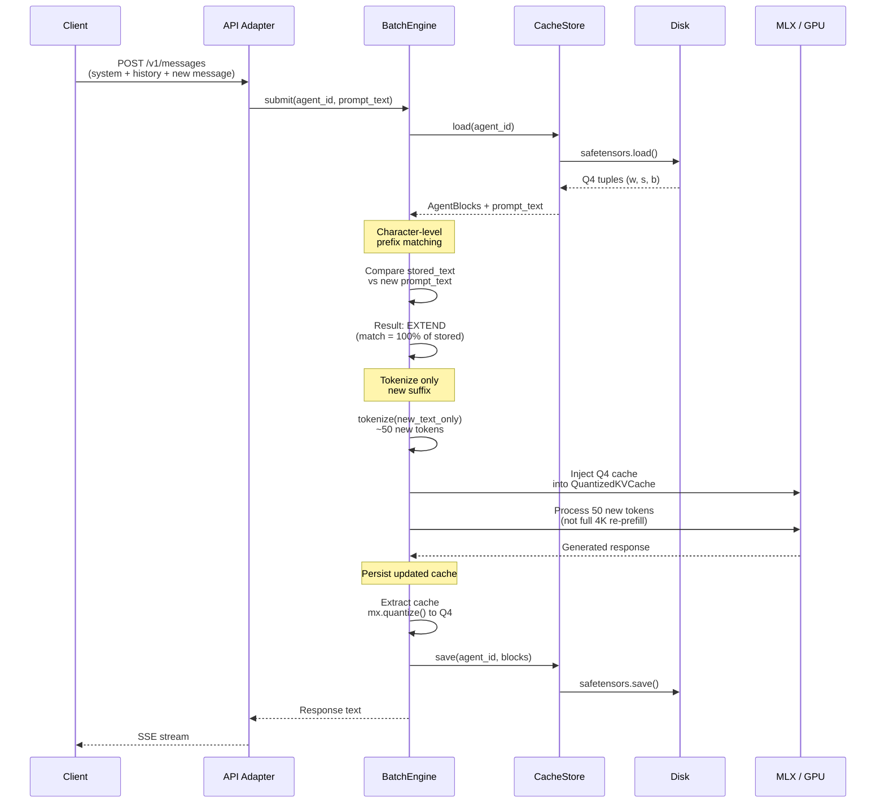

### 4.4 Working Memory: Case Studies

#### Prisoner's Dilemma (5 phases, 3+1 agents)

The prisoner's dilemma scenario exercises cross-phase working memory with information asymmetry:

**Phase structure:**
1. **Room A** — Warden interrogates Marco (3 rounds)
2. **Room B** — Warden interrogates Danny (3 rounds)
3. **The Yard** — Marco and Danny meet alone (2 rounds)
4. **Final Reckoning** — All three, final decisions (2 rounds)
5. **The Verdict** — Analyst applies payoff matrix (1 round)

**Working memory dynamics:**
- The **Warden** is a permanent agent whose KV cache carries across Phases 1, 2, and 4. In Phase 2, the Warden's prompt includes all Phase 1 messages as prior context — the engine detects this as an EXTEND of the Phase 1 cache and only processes the new Phase 2 tokens.
- **Marco** and **Danny** each have isolated caches. Marco's cache contains only what Marco has seen (Room A + The Yard). Danny's cache contains only what Danny has seen (Room B + The Yard). Neither can see the other's interrogation.
- In Phase 4, when all agents reconvene, each agent's prompt is constructed with their complete prior history as a prefix. The engine extends each agent's existing cache, avoiding re-computation.

**Cache key scheme:**
```
persist_prisoners-dilemma_scn_prisoners-dilemma_warden   # Warden: Phases 1, 2, 4
persist_prisoners-dilemma_scn_prisoners-dilemma_marco     # Marco:  Phases 1, 3, 4
persist_prisoners-dilemma_scn_prisoners-dilemma_danny     # Danny:  Phases 2, 3, 4
coord_{session_id}_scn_prisoners-dilemma_analyst          # Analyst: Phase 5 only (ephemeral)
```

#### Gossip Network (3 phases, 3 agents)

The gossip scenario demonstrates private information compartmentalization with working memory:

**Phase structure:**
1. **Alice & Bob** — Private gossip about Eve (3 rounds)
2. **Alice & Eve** — Private gossip about Bob (3 rounds)
3. **Reunion** — All three meet; each has private memories only they can see

**Working memory dynamics:**
- Alice participates in all 3 phases. Her KV cache accumulates across phases. In Phase 3, her prompt includes resolved templates:
  ```
  YOUR PRIVATE MEMORIES (only you can see this):
  From your private chat with Bob:
  You: [Phase 1 messages from Alice's perspective]
  Bob: [Phase 1 messages from Bob]
  From your private chat with Eve:
  You: [Phase 2 messages from Alice's perspective]
  Eve: [Phase 2 messages from Eve]
  ```
- Bob and Eve each see only their own conversation history. Bob's Phase 3 prompt includes only Phase 1 content. Eve's includes only Phase 2 content.
- The perspective normalization (labeling the target agent's messages as "You") ensures the model maintains first-person identity when reading its own cached context.

**Key architectural feature:** The `visible_to` scoping on injected messages means the API returns clean transcripts (no leaked private information) while the prompt builder includes the full context (for KV cache prefix matching). This separation of concerns — API visibility vs. cache coherence — is what makes private working memory possible in multi-agent settings.

---

## 5. Evaluation

### 5.1 Experimental Setup

- **Hardware:** Apple Silicon M4 Pro (24 GB), M4 Max (64 GB)
- **Models:** SmolLM2-135M (unit tests), DeepSeek-Coder-V2-Lite 16B Q4 (multi-turn benchmarks), Gemma 3 12B Q4 (streaming/context scaling benchmarks), GPT-OSS 20B (stress)
- **Baselines:** Cold re-prefill (no cache), LM Studio (llama.cpp backend)
- **Methodology:** 3 runs per measurement, median reported, temperature 0.0 (deterministic), 64 output tokens unless noted
- **Test suite:** 995 tests across 6 tiers (unit, integration, MLX, E2E, smoke, stress)

### 5.2 Cache I/O Latency

The fundamental operation — loading a Q4 KV cache from disk into unified memory — is fast because UMA eliminates the host-to-device transfer:

| Cache Size (tokens) | safetensors File | Load Time |
|--------------------|-----------------|-----------|
| 500 | ~2 MB | ~5 ms |
| 4,000 | ~15 MB | ~20 ms |
| 20,000 | ~75 MB | ~80 ms |

These times represent the I/O operation only. The full end-to-end request includes additional overhead from tokenization, prefix matching, processing new tokens, and generation.

### 5.3 Cold Start Scaling

Prefill latency on Apple Silicon scales roughly linearly with context length:

| Context (tokens) | TTFT (ms) | E2E (ms) | TPS |
|-------------------|-----------|----------|-----|
| 200 | 388 | 993 | 105.8 |
| 500 | 523 | 1,123 | 93.1 |
| 1,000 | 742 | 1,392 | 83.2 |
| 2,000 | 1,643 | 2,487 | 75.8 |
| 4,000 | 3,390 | 4,600 | 56.1 |
| 8,000 | 7,898 | 9,487 | 40.5 |
| 16,000 | 19,627 | 24,104 | 13.4 |
| 32,000 | 48,058 | 60,836 | 5.0 |

This is the cost that cache persistence eliminates. At 32K tokens, cold prefill alone takes 48 seconds — any cache reuse that avoids this re-computation delivers substantial savings.

### 5.4 End-to-End Multi-Turn Speedup

Three-turn conversation with ~2,000 token initial context. Turn 2 and Turn 3 reuse the KV cache via the EXTEND path (character-level prefix matching identifies the cached prefix and processes only new tokens):

| Turn | E2E (ms) | TPS | Speedup vs Turn 1 |
|------|----------|-----|-------------------|
| Turn 1 (cold) | 2,409 | 26.6 | -- |
| Turn 2 (warm) | 1,229 | 52.1 | **2.0x** |
| Turn 3 (warm) | 1,246 | 51.4 | **1.9x** |

The speedup is consistent across conversation depth — no degradation at deeper turns. This contrasts with LM Studio, which degrades at Turn 3+ (see Section 5.9).

**Prefix sharing** — two different queries sharing a 1,000-token system prompt:

| Request | E2E (ms) | TPS | Speedup |
|---------|----------|-----|---------|
| A (cold prefix) | 1,554 | 40.2 | -- |
| B (shared prefix) | 965 | 64.4 | **1.6x** |

**GPT-OSS 20B multi-turn cache reuse:**

| Turn | E2E Time | Tokens/sec | Speedup vs Cold |
|------|----------|-----------|-----------------|
| Turn 1 (cold) | 3,117 ms | 20.5 | -- |
| Turn 2 (warm) | 1,437 ms | 44.5 | **2.2x** |
| Turn 3 (warm) | 1,421 ms | 45.0 | **2.2x** |

### 5.5 TTFT Speedup vs Context Length (Gemma 3 12B)

Comprehensive streaming benchmarks on Gemma 3 12B (Q4) demonstrate that the TTFT speedup from persistent cache depends critically on whether the cache is in-memory or reloaded from disk. Three cache states are measured:

- **Cold:** No cache exists. Full re-prefill of the entire context from scratch.
- **Warm (disk reload):** Cache was persisted to disk in a prior session. The server has been restarted; the system loads Q4 safetensors from disk, reconstructs the `QuantizedKVCache`, matches the prompt prefix, and processes only the new suffix. Measured via dedicated server-restart test (cold request → kill server → restart → follow-up request).
- **Hot (in-memory extend):** Cache is already in memory from a prior turn in the same session. The system extends the existing cache by processing only the new suffix tokens. Hot TTFT = new suffix processing only.

**TTFT by cache state:**

| Context | Cold TTFT | Warm (disk) TTFT | Hot (memory) TTFT | **Warm Speedup** | **Hot Speedup** |
|---------|-----------|-----------------|-------------------|------------------|-----------------|
| 1,024 | 3,618 ms | 949 ms | 654 ms | **2.0x** | **5.5x** |
| 2,048 | 6,950 ms | — | 700 ms | — | **9.9x** |
| 4,096 | 15,448 ms | 3,980 ms | 869 ms | **1.7x** | **17.8x** |
| 8,192 | 32,312 ms | 8,436 ms | 750 ms | **1.2x** | **43.1x** |
| 16,384 | 68,898 ms | 19,867 ms | 844 ms | **1.1x** | **81.6x** |

*Cold and Hot: median of 3 runs from streaming benchmark (64 output tokens, M4 Pro 24GB). Warm (disk): median of 3 runs from dedicated server-restart test. Warm speedup computed against warm test's own cold baseline (1,901ms / 6,800ms / 9,978ms / 21,361ms for 1K / 4K / 8K / 16K respectively). The warm test uses shorter prompt templates than the streaming benchmark, so warm speedup is reported relative to its own cold baseline for methodological consistency.*

**End-to-end speedup (hot cache):**

| Context | Cold E2E (ms) | Hot E2E (ms) | E2E Speedup |
|---------|--------------|-------------|-------------|
| 1,024 | 15,398 | 12,663 | 1.2x |
| 2,048 | 19,331 | 13,120 | 1.5x |
| 4,096 | 28,748 | 14,278 | 2.0x |
| 8,192 | 47,153 | 16,072 | 2.9x |
| 16,384 | 85,537 | 19,667 | **4.3x** |

**Key observations:**

1. **Hot TTFT is nearly constant** (~650--870ms) across all context lengths — only the new suffix tokens are processed. **Warm TTFT scales with context length** — from 949ms at 1K to 19.9s at 16K — because disk reload involves cache reconstruction overhead that grows with sequence length. The warm path must deserialize Q4 safetensors, reconstruct the `QuantizedKVCache` object, and re-validate prefix matching before processing the suffix.

2. **Hot TTFT speedup scales linearly with context.** At 1K, the speedup is a modest 5.5x. At 16K, it reaches **81.6x** because cold prefill takes 69 seconds while cached restoration takes under 1 second. Warm (disk) speedup is more modest: 2.0x at 1K declining to 1.1x at 16K.

3. **Warm benefit diminishes at long contexts.** At 1K, the disk cache saves ~50% of cold time (2.0x). At 16K, it saves only ~7% (1.1x). This suggests that cache reconstruction cost scales similarly to cold prefill at longer contexts — the dominant cost shifts from I/O to attention recomputation during prefix validation.

4. **E2E speedup grows but is bounded by decode time.** Since the model generates ~300+ tokens of output, decode time dominates E2E at shorter contexts. At 16K, the avoided prefill (69s) makes up ~76% of cold E2E, giving a **4.3x E2E speedup**.

5. **EXACT match (same prompt) re-prefills intentionally.** Sending the identical prompt again triggers the EXACT match path which re-computes to avoid output bias from cached generation state. The speedup requires the **EXTEND** path — multi-turn conversations where the prompt grows by appending new messages.

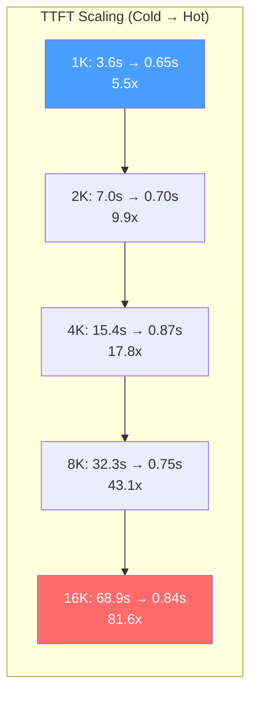

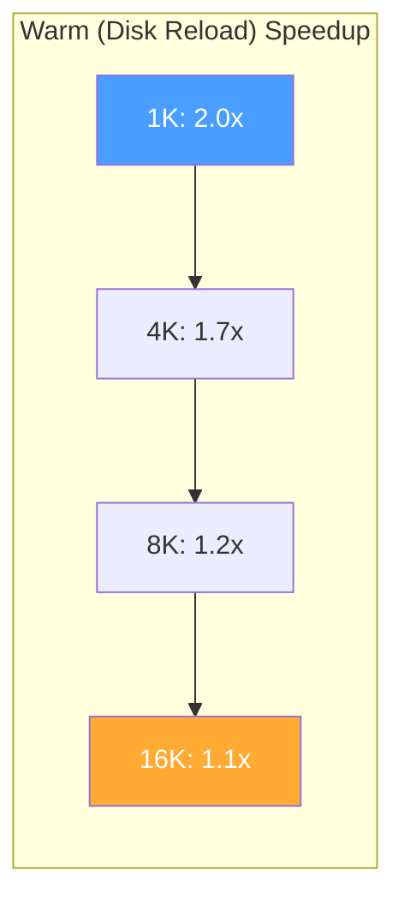

### 5.6 Streaming vs Non-Streaming

Streaming (SSE) provides a significant user experience improvement by delivering the first token at TTFT time rather than waiting for the full response. The decode TPS is equivalent for both modes — the apparent TPS difference in raw measurements is an artifact of the non-streaming metric including prefill time in its denominator.

| Context | Mode | Cold TTFT (ms) | Decode TPS | E2E (ms) |
|---------|------|---------------|-----------|----------|
| 1,024 | Streaming | 3,618 | 30.9 | 15,398 |
| 1,024 | Non-streaming | (= E2E) | 30.8* | 15,430 |
| 4,096 | Streaming | 15,448 | 27.3 | 28,740 |
| 4,096 | Non-streaming | (= E2E) | 27.5* | 28,692 |
| 8,192 | Streaming | 32,312 | 23.7 | 47,153 |
| 8,192 | Non-streaming | (= E2E) | 24.0* | 46,580 |
| 16,384 | Streaming | 68,898 | 18.8 | 85,537 |
| 16,384 | Non-streaming | (= E2E) | 18.8* | 84,893 |

\* *Non-streaming decode TPS computed as output_tokens / (E2E - estimated_prefill). The reported non-streaming TPS (output_tokens / E2E) conflates prefill with decode.*

**Streaming advantage is in interactivity, not throughput.** Both modes generate tokens at the same rate. Streaming delivers tokens to the user as they're produced (visible at TTFT); non-streaming buffers the entire response. For a 16K-context cold request, the user sees the first token after 69 seconds (streaming) vs. 85 seconds (non-streaming, full response).

### 5.7 Batch=2 Concurrent Throughput

The ConcurrentScheduler enables serving multiple agents simultaneously through interleaved prefill and per-token decode steps. To measure the throughput benefit, we send 2 simultaneous requests and compare to single-request performance.

**Simultaneous arrivals — Batch=2 vs Batch=1 (Gemma 3 12B Q4, M4 Pro 24GB):**

| Context | Metric | Batch=1 | Batch=2 (concurrent) | Change |
|---------|--------|---------|---------------------|--------|
| 1,024 | Wall time | 15,548 ms | 23,080 ms | 1.48x |
| 1,024 | E2E (2 requests) | 31,096 ms* | 23,080 ms | **0.74x** |
| 1,024 | System throughput (tok/s) | 23.3 | 31.5 | **+35%** |
| 1,024 | Per-stream decode TPS | 30.8 | 22.8 | 0.74x |
| 1,024 | TTFT | 3,762 ms | 7,174 ms | 1.91x |
| 4,096 | Wall time | 28,631 ms | 49,720 ms | 1.74x |
| 4,096 | E2E (2 requests) | 57,262 ms* | 49,720 ms | **0.87x** |
| 4,096 | System throughput (tok/s) | 12.7 | 14.6 | **+15%** |
| 4,096 | Per-stream decode TPS | 27.4 | 14.9 | 0.54x |
| 4,096 | TTFT | 15,420 ms | 23,093 ms | 1.50x |

\* *Batch=1 E2E for 2 requests = 2 × single-request wall time (sequential execution).*

**Batch=2 vs Batch=1 (DeepSeek Coder V2 Lite 4-bit, M4 Pro 24GB):**

| Context | Metric | Batch=1 | Batch=2 (concurrent) | Change |
|---------|--------|---------|---------------------|--------|
| 1,024 | Wall time | 1,906 ms | 3,280 ms | 1.72x |
| 1,024 | System throughput (tok/s) | 54.0 | 62.8 | **+16%** |
| 1,024 | Per-stream decode TPS | 104.8 | 69.9 | 0.67x |
| 1,024 | TTFT | 923 ms | 1,743 ms | 1.89x |
| 4,096 | Wall time | 6,789 ms | 11,797 ms | 1.74x |
| 4,096 | System throughput (tok/s) | 37.3 | 31.8 | 0.85x |
| 4,096 | Per-stream decode TPS | 88.1 | 49.0 | 0.56x |
| 4,096 | TTFT | 3,918 ms | 7,297 ms | 1.86x |

*Median of 3 runs, streaming mode. System throughput = total output tokens / wall time. Per-stream decode TPS = per-stream tokens / per-stream decode time (each stream measured independently). Batch=2 sends 2 requests simultaneously via asyncio.gather.*

**Key observations:**

1. **Gemma 3 achieves +35% system throughput at 1K context and +15% at 4K.** This is the first demonstration of batched Q4 inference on a hybrid GQA + sliding window architecture. The throughput gain is higher than DeepSeek at 1K (+35% vs +16%), likely because Gemma 3's GQA with 4 KV heads (repeats=2) shares more weight reads across batch sequences. At 4K, both models show diminished gains as memory bandwidth for reading larger KV caches becomes the bottleneck.

2. **DeepSeek shows throughput regression at 4K (-15%).** The negative throughput at longer context on DeepSeek reflects its MoE architecture: active parameter reads plus 2× KV cache reads exceed the UMA bandwidth budget at 4K context. Gemma 3's dense architecture handles the bandwidth pressure more gracefully (+15% vs -15%).

3. **Per-stream latency roughly doubles.** Each user experiences ~1.5--1.9x higher TTFT and ~0.54--0.72x decode TPS when sharing the GPU. This is expected: the scheduler interleaves tokens between the two sequences, so each sequence receives attention at half the rate.

4. **Wall time is consistently ~1.5--1.7x of single-request**, not 2.0x. The batched generation avoids the overhead of two separate prefill passes (they're interleaved) and shares model weight reads across sequences.

5. **The implementation is an MVP.** The throughput numbers reflect the first working concurrent inference on Q4 quantized caches — a capability absent from upstream mlx-lm. Optimization opportunities include: dynamic batch scheduling, prefill-decode separation to avoid head-of-line blocking, and larger batch sizes on higher-memory devices.

**Staggered arrivals — User B's TTFT (Gemma 3 12B Q4, M4 Pro 24GB):**

The simultaneous-arrival benchmarks above show TTFT *increasing* under batch=2 (both users pay for shared prefill). However, the more realistic scenario is **staggered arrivals**: User B arrives while User A is already mid-generation. Here, the interleaved scheduler provides a dramatic TTFT improvement for User B.

Under sequential processing (no scheduler), User B must wait for User A to finish *all* tokens (prefill + decode) before B's prefill can even begin. With the `ConcurrentScheduler`, B's prefill is interleaved with A's decode steps — B starts receiving tokens while A is still generating.

| Context | Metric | Sequential | Batched (staggered) | Change |
|---------|--------|-----------|---------------------|--------|
| 1,024 | User A TTFT | 5,849 ms | 6,112 ms | 1.04x |
| 1,024 | **User B TTFT** | **24,531 ms** | **9,608 ms** | **2.6x faster** |
| 4,096 | User A TTFT | 25,120 ms | 41,306 ms | 1.64x |
| 4,096 | **User B TTFT** | **65,664 ms** | **48,244 ms** | **1.4x faster** |

*Median of 3 runs, streaming mode. User B arrives 2 seconds after User A. Sequential "User B TTFT" = (A_E2E − 2s) + B_prefill, simulating B waiting for A to complete before starting. Batched "User B TTFT" = actual measured TTFT from B's send time, with scheduler interleaving B's prefill into A's decode steps.*

**Key observations:**

6. **User B sees 2.6x faster TTFT at 1K context.** Under sequential processing, B waits ~19s for A to finish (prefill + 427 tokens of decode), then does its own 5.7s prefill — total 24.5s before B's first token. With the scheduler, B's prefill is interleaved with A's decode, delivering B's first token in 9.6s. User A pays only a 4% TTFT penalty (6.1s vs 5.8s) for sharing the GPU.

7. **At 4K context, interleaving still helps (1.4x) but with a cost to User A.** Both users have long prefills (~25s each), so interleaving competes for prefill bandwidth. User A's TTFT increases from 25.1s to 41.3s (1.64x). However, User B still benefits: 48.2s vs 65.7s sequential. The net effect is positive — total time-to-first-token across both users is 50.4s (batched) vs 90.8s (sequential).

8. **Staggered arrivals are the realistic workload.** In multi-agent scenarios, requests rarely arrive at the exact same millisecond. The staggered results show the scheduler's primary value: transforming a head-of-line-blocking sequential queue into an interleaved pipeline where User B's prefill overlaps with User A's decode.

### 5.8 Memory Efficiency

**Q4 vs FP16 KV cache footprint (Gemma 3 12B, M4 Pro 24 GB):**

| Configuration | Available Cache Memory | Max Agents (4K ctx) | Max Context (1 agent) |
|--------------|----------------------|--------------------|-----------------------|
| FP16 cache, no chunking | ~6 GB | 2 | ~17K tokens |
| FP16 cache, chunked | ~6 GB | 2 | ~25K tokens |
| **Q4 cache, chunked** | **~11 GB** | **5+** | **~35K tokens** |
| **Q4 cache, chunked, persisted** | ~11 GB active + unlimited disk | **5+ active, unlimited warm** | **~80K+ tokens** |

### 5.9 LM Studio Comparison

Side-by-side comparison using the same model (DeepSeek-Coder-V2-Lite 16B Q4) and identical prompts:

**Multi-turn (3 turns, ~2K context, 64 output tokens):**

| Server | Turn 1 | Turn 2 | Turn 3 | T1 to T2 Speedup |
|--------|--------|--------|--------|-------------------|
| **Semantic** | 2,379 ms | 1,202 ms | 1,205 ms | **2.0x** |
| LM Studio | 2,304 ms* | 778 ms | 2,845 ms | 0.9x (at T3) |

\* LM Studio Turn 1 median includes cross-run prefix caching (runs 2-3 reused run 1's prompt cache). Cold Turn 1 was 2,304 ms.

**Key finding:** LM Studio's Turn 2 is faster (778 ms vs 1,202 ms) due to llama.cpp's optimized Metal kernels. But **LM Studio regresses at Turn 3** to 2,845 ms (only 49% of tokens cached). Semantic maintains consistent ~1.2s for all follow-up turns because character-level prefix matching ensures the cache always extends properly.

| Capability | Semantic | LM Studio |
|------------|----------|-----------|
| Cold short TTFT | 388 ms | ~116 ms |
| Multi-turn consistency | **Stable at all depths** | Degrades at Turn 3+ |
| Max practical context | **50K+ tokens** | ~4K tokens |
| Disk persistence | **Yes (safetensors)** | No |
| Multi-agent isolation | **Yes (per-session)** | No |
| Q4 KV cache | **Yes (72% savings)** | No |
| Cache extends across turns | **Yes (character-level)** | Partial (token-level) |

### 5.10 Character-Level vs Token-Level Matching

Pre-fix data showing the severity of BPE mismatches:

| Context Size | Token Matching (BPE miss) | Character Matching (EXTEND) |
|-------------|--------------------------|----------------------------|
| Short (153 tokens) | 1,661 ms (*slower* than cold) | ~5 ms cache I/O |
| Medium (1,449 tokens) | 65,861 ms (20x worse!) | ~50 ms cache I/O |
| Long (5,780 tokens) | CRASH | ~100 ms cache I/O |

Token matching was *slower* than cold start because the system loaded the cache, compared tokens, diverged at a BPE boundary, then had to discard the cache *and* re-prefill from scratch. Character-level matching eliminates this entirely.

---

## 6. Discussion

### 6.1 Novelty Classification

We assess the novelty of each technique on a spectrum from "Pure Engineering" to "Novel Contribution":

| Technique | Classification | Role in System |
|-----------|---------------|----------------|
| **Persistent Block Pool** (per-agent isolation) | **Novel** | Core contribution — no prior system provides this combination |
| **KV Cache as Working Memory** (cross-phase) | **Novel framing** | Second contribution — positions KV cache as RAG alternative |
| **BatchQuantizedKVCache** (Q4 batched inference) | **Novel** | No public MLX implementation exists; mlx-lm issue #548 confirms unimplemented. Tested on 4 architectures including hybrid GQA + sliding window (Gemma 3) |
| **Interleaved Prefill + Decode Scheduling** | **Incremental (significant)** | Per-token decode granularity with round-robin prefill; enables streaming + batching. Measured +35% system throughput on Gemma 3 at 1K context and 2.6x User B TTFT improvement with staggered arrivals (Section 5.7) |
| Character-Level Prefix Matching | Incremental | Key supporting technique — makes persistence practical |
| Q4 End-to-End Pipeline | Incremental | Supporting technique — makes edge deployment feasible |
| YAML Multi-Agent Coordination | Engineering | Demonstration vehicle for working memory |
| Adaptive Chunked Prefill | Engineering | Practical necessity for UMA |
| Lazy Evaluation Discipline | Engineering | Practical necessity for MLX |
| Attention Sink Compat | Engineering | Compatibility layer |

The **Persistent Block Pool with Per-Agent KV Cache Isolation** is the one element that no prior system provides. The combination of agent identity awareness, Q4 disk persistence, multi-architecture support, and correct concurrency semantics is unique.

The **BatchQuantizedKVCache** is independently novel — no public MLX codebase implements batched inference over quantized KV caches. The `merge()`, `update_and_fetch()`, and `extract()` operations, plus three monkey-patches to upstream `mlx-lm`, enable a capability that the mlx-lm maintainers have acknowledged as needed but not built (issue #548). Combined with the `ConcurrentScheduler`'s per-token interleaving, this enables true streaming responses during batched inference — a capability absent from both `mlx-lm` and `vllm-mlx`.

The **KV Cache as Working Memory** framing is the third contribution. While individual papers (MemArt, EM-LLM) have explored KV cache as memory, none have demonstrated it in a multi-phase coordination system with per-agent isolation and disk persistence. The prisoner's dilemma and gossip scenarios show working memory in action: agents carry computed attention state across phases rather than re-computing from retrieved text.

**Weakest claim:** "Zero-copy on UMA" — should be stated as "zero-format-conversion" since `mx.array()` does involve a memory copy at the load boundary. The disk-to-GPU path avoids *format* conversion (Q4 stays Q4), not *memory* copying.

### 6.2 The Working Memory Paradigm

The working memory contribution is best understood through comparison with existing approaches:

**Traditional RAG pipeline:**
```
Query -> Embed -> Vector Search -> Retrieve Text Chunks -> Stuff into Prompt -> Re-prefill from Scratch
```
Every request pays the full prefill cost over retrieved context, regardless of how many times the same context has been processed.

**RAG-DCache (Lee et al., 2025):**
```
Documents -> Precompute KV Caches -> Store to Disk -> Load on Query -> Merge with Query KV
```
Eliminates re-prefill for *documents*, but operates at the document level — no agent identity, no cross-phase coordination, no per-agent isolation. A step toward KV cache as memory, but limited to the RAG retrieval paradigm.

**Semantic (this work):**
```
Agent Turn -> Compute KV -> Persist Q4 to Disk -> Next Turn: Load + EXTEND -> Persist Updated KV
```
The KV cache *is* the agent's memory. It accumulates across turns and phases. Cross-phase context injection constructs prompts that share prefixes with cached state, enabling the EXTEND path. No vector search, no text retrieval — the memory is the attention state itself.

**Why this matters for multi-agent systems:**

In the gossip network scenario, Alice accumulates private knowledge from two separate conversations. In Phase 3 (reunion), Alice's working memory contains the computed attention state from both prior phases. Her behavior in the reunion is influenced not just by the text of prior conversations (which RAG would provide) but by the *model's processed understanding* of those conversations — the attention patterns, the weighted relationships between tokens. This is a fundamentally richer form of memory than text retrieval.

### 6.3 Comparison to vllm-mlx

The closest related work for the persistence contribution is **vllm-mlx** (Barrios et al., arXiv:2601.19139, January 2026), which brings continuous batching and content-based prefix caching to Apple Silicon via MLX. The two systems solve different problems on the same platform:

| Capability | vllm-mlx | Semantic |
|-----------|----------|----------|
| Throughput (concurrent requests) | Continuous batching | BatchGenerator |
| Prefix caching (in-memory) | Hash-based, ephemeral | Character-level |
| Disk persistence | None | safetensors Q4 |
| Agent isolation | None | Per-agent block pool |
| KV cache quantization | FP16/BF16 | Q4 end-to-end |
| Context capacity (24 GB) | ~8K per agent | ~32K per agent |
| Restart recovery | Full cold-start | Sub-100ms reload |
| Multi-phase working memory | None | Cross-phase injection |
| Scheduling sophistication | Continuous batching | Basic asyncio |
| Model support breadth | vLLM model registry | 4 architectures |
| Maturity | Production-grade | Research prototype |

**vllm-mlx** is a *serving engine* — it optimizes request throughput and latency for concurrent users. **Semantic** is a *cache management system* — it optimizes cache reuse across agent sessions, including across process restarts. These are complementary; Semantic's persistence layer could sit behind vllm-mlx's serving engine.

The `BatchQuantizedKVCache` adds a capability that neither system previously offered: concurrent generation over agents' *persisted* Q4 caches with per-token streaming. vllm-mlx has continuous batching but ephemeral FP16 caches; mlx-lm has quantized caches but no batching support for them; Semantic bridges both with `merge()` (disk to batch) and `extract()` (batch to disk).

### 6.4 Comparison to RAG-DCache

**RAG-DCache** (Lee et al., arXiv:2504.11765, April 2025) precomputes document-level KV caches and stores them to disk, achieving 15--71% throughput increase for RAG workloads. Key differences:

| Property | RAG-DCache | Semantic |
|----------|-----------|----------|
| Cache granularity | Document chunk | Per-agent session |
| Use case | RAG retrieval acceleration | Agent working memory |
| Agent isolation | None | Per-agent namespacing |
| Cross-phase memory | None | YAML-driven coordination |
| Cache update | Static (precomputed) | Dynamic (extends per turn) |
| Quantization | Not specified | Q4 end-to-end |
| Target hardware | CUDA datacenter | Apple Silicon UMA |

RAG-DCache optimizes the *document retrieval* step of RAG. Semantic replaces RAG entirely for agent workflows — the cached KV state *is* the agent's context, not a precomputed acceleration of text retrieval.

### 6.5 Attention-Layer vs Message-Layer Coordination

The emergence of standardized agent communication protocols — Google's **A2A** (Agent2Agent, April 2025, now under the Linux Foundation), Anthropic's **MCP** (Model Context Protocol), and others — raises a positioning question: where does KV cache coordination fit in the protocol stack?

**A2A operates at the message layer.** Its primitives are Agent Cards (capability advertisements), Tasks (stateful work units), Messages (text/file exchanges), and Artifacts (generated outputs). Communication flows over HTTP with JSON-RPC and SSE. Agents are treated as opaque black boxes — A2A neither knows nor cares what model an agent runs, whether it has a KV cache, or what its attention state looks like. This is by design: A2A solves the *interoperability* problem (how do agents from different vendors talk to each other?), not the *efficiency* problem (how do agents on the same device share computation?).

**This system operates at the attention layer.** The block pool manages KV cache state *below the prompt level* — at the level of attention-layer key-value pairs that encode the model's processed understanding of conversation history. This is a fundamentally different abstraction level:

| Property | A2A / MCP (Message Layer) | Semantic (Attention Layer) |
|----------|--------------------------|---------------------------|
| Abstraction unit | Text messages, files | KV cache blocks (Q4 tensors) |
| Agent model | Opaque black box | Semi-transparent (cache-aware) |
| Information transfer | Serialize → transmit → re-parse → re-prefill | Load cached attention state directly |
| Cross-agent sharing | Re-send full text | Share cached prefix (EXTEND path) |
| Coordination overhead | O(n) per message (full re-prefill) | O(1) cache load (~50ms) |
| Scope | Cross-vendor, cross-network | Single device, same model |
| Protocol level | Layer 7+ (application) | Below Layer 7 (attention state) |

**Cisco's "Internet of Cognition" framework** (2025) identifies this gap explicitly. Their analysis distinguishes Layer 8 (syntactic protocols for message exchange — A2A, MCP) from a proposed Layer 9 (semantic cognition protocols for shared intent, memory, and knowledge). A2A and MCP solve Layer 8. The KV cache block pool operates closer to Layer 9 — managing the *computed cognitive state* (attention patterns, weighted token relationships) rather than the *textual representation* of that state.

**Information loss at the message boundary.** When Agent A communicates with Agent B via A2A, the following happens: Agent A generates a text response → text is serialized to JSON → transmitted to Agent B → Agent B's model re-prefills over the received text from scratch. The attention patterns, token-level relationships, and contextual weights that Agent A's model computed are *destroyed* at the serialization boundary. Every inter-agent message in A2A pays the full prefill cost on the receiving side.

KV cache coordination avoids this loss for agents sharing the same model: Agent A's KV cache can be directly loaded by Agent B (if they share a prefix), preserving the model's computed understanding without re-computation. This only works when agents share the same model architecture — a fundamental scope limitation, but one that applies to the common case of multi-agent workflows running on a single device.

**Complementary, not competing.** A2A and KV cache coordination operate at different levels and solve different problems. A2A enables a Gemini agent to talk to a Claude agent across the internet. KV cache coordination enables three Gemma 3 agents on the same MacBook to share attention state efficiently. A future system could use A2A for cross-vendor coordination while using KV cache persistence for intra-device efficiency — the same way TCP/IP handles network transport while shared memory handles local IPC.

### 6.6 Limitations

1. **Single-device only.** No distributed agent cache sharing — all agents must run on the same Apple Silicon device.

2. **Q4 accuracy not rigorously benchmarked.** The system uses uniform symmetric group quantization (group_size=64, bits=4) for both keys and values. KIVI (NeurIPS 2024) showed that keys and values have different quantization sensitivity. A full perplexity comparison (Q4 KV vs FP16 KV on WikiText-2, C4) is needed.

3. **Four architectures tested.** While the `ModelCacheSpec` abstraction is designed to be universal, only Gemma 3, GPT-OSS, Llama 3.1, and Qwen 2.5 have been validated.

4. **No speculative decoding.** On UMA, decode is memory-bound and already fast (~50 tok/s). Prefill is the bottleneck, which persistence addresses. But speculative decoding could further improve interactive latency.

5. **Working memory evaluation is qualitative.** The prisoner's dilemma and gossip scenarios demonstrate the mechanism but do not include quantitative comparisons against RAG-based agent memory on standardized benchmarks.

### 6.7 Future Directions

- **Integration with vllm-mlx** — Semantic's persistence layer as a backend for vllm-mlx's serving engine
- **Quantitative working memory benchmarks** — Compare KV cache working memory vs RAG-based agent memory on multi-agent reasoning benchmarks (e.g., AgentBench, GAIA)
- **Network-backed cache sharing** — Serialized Q4 safetensors as a new form of agent state transfer between devices
- **Adaptive quantization** — Mixed Q4/Q8 based on layer sensitivity (KIVI-style per-channel keys, per-token values)
- **Formal perplexity benchmarking** — WikiText-2 and C4 comparisons of Q4 vs FP16 KV cache across all supported models
- **Retrieval over cached KV segments** — Attention-score-based retrieval (MemArt-style) to select relevant cached segments rather than reloading the full cache

---

## 7. Related Work

### 7.1 KV Cache Management Systems

**vLLM** (Kwon et al., 2023) introduced PagedAttention for efficient GPU VRAM management with thousands of concurrent requests. Caches are ephemeral — discarded after each request.

**SGLang** (Zheng et al., 2024) uses RadixAttention for token-level prefix caching via a radix tree. Caches are in-memory only and do not survive server restarts.

**LMCache** (2024) extends caching to disk and S3 storage with CacheGen compression. Closest to our persistence approach, but CUDA-only, no per-agent isolation, and no Q4 end-to-end pipeline.

**HiCache** (SGLang, 2025) adds hierarchical caching (GPU -> CPU -> disk) with P2P transfers. CUDA-focused; the hierarchical approach is unnecessary on UMA where all memory levels share the same physical DRAM.

**vllm-mlx** (Barrios, 2026) brings vLLM-style continuous batching and content-based prefix caching to Apple Silicon. No disk persistence, no per-agent isolation, FP16-only KV cache.

### 7.2 KV Cache Compression

**KIVI** (Liu et al., NeurIPS 2024) demonstrated that keys and values have different quantization sensitivity — keys benefit from per-channel quantization while values benefit from per-token quantization. Our system uses uniform group quantization for both; adopting KIVI's mixed strategy could improve quality.

**KVQuant** (Hooper et al., 2024) pushed KV quantization to 2-bit with per-channel sensitivity analysis. Applicable as a future optimization.

**CacheGen** (Liu et al., 2024) proposed a compression codec specifically for KV cache transmission. Our safetensors-based approach prioritizes simplicity and compatibility over maximum compression ratio.

### 7.3 KV Cache as Memory

**MemArt** (OpenReview, October 2025) — "KVCache-Centric Memory for LLM Agents." Stores conversational turns as reusable KV cache blocks, retrieves relevant blocks via attention score similarity. Reports 11% accuracy improvement over plaintext memory and 91--135x fewer prefill tokens. Most directly related to our working memory contribution, but operates in-memory (no disk persistence) and does not address multi-agent isolation.

**Memory3 / MemOS** (2025) — Makes the KV cache an explicit memory carrier. Encodes external knowledge as sparse KV pairs injected into attention layers. Proposes a "memory operating system" abstraction. Conceptually aligned with our vision of KV cache as working memory, but focused on knowledge injection rather than agent state persistence.

**EM-LLM** (ICLR 2025) — Episodic memory via KV-pair retrieval as a RAG alternative. Segments past context into episodes, retrieves relevant KV pairs using surprise-based boundaries. Outperforms traditional RAG by 30.5% on LongBench. Validates the principle that KV-level memory outperforms text-level retrieval.

**RAG-DCache** (Lee et al., arXiv:2504.11765, April 2025) — Disk-based KV cache for RAG document chunks. Precomputes KV caches offline and stores to disk. Achieves 15--71% throughput improvement. Operates at the document level with no agent isolation, no cross-phase coordination, and no cache update semantics. See Section 6.4 for detailed comparison.

### 7.4 RAG and Alternatives

**PageIndex.ai** (Vectify AI, 2025) — A vectorless, reasoning-based RAG engine that uses tree-structured indexes instead of vector similarity. Reports 98.7% accuracy on FinanceBench. Represents a different trajectory — improving RAG by replacing vectors with reasoning — rather than replacing RAG with KV cache memory. Complementary to our approach: PageIndex could select *which* information to inject into an agent's KV cache.

**RAPTOR** (Sarthi et al., 2024) — Recursive abstractive processing for tree-organized retrieval. Builds a tree of text summaries at different abstraction levels. Like PageIndex, focuses on improving the retrieval quality of text-based RAG rather than moving to attention-layer memory.

### 7.5 Multi-Agent KV Cache Research

**KVCOMM** (NeurIPS 2025) enables cross-context KV reuse between agents in multi-agent reasoning. Datacenter-focused; we add edge deployment with Q4 persistence.

**KVFlow** (NeurIPS 2025) proposes workflow-aware cache eviction policies for multi-agent DAGs. Complementary to our character-level matching approach.

**Continuum** (2025) introduces TTL-based agent cache management for pause/resume scenarios. Our disk persistence survives server restarts, which Continuum's in-memory approach does not.

**LRAgent** (February 2025) decomposes KV cache into shared base components and adapter-dependent components for multi-LoRA agent scenarios. Each agent applies a different LoRA adapter to the same base model, and LRAgent avoids redundant prefill by sharing the base KV cache while computing only the adapter-specific deltas. This is conceptually related to our prefix sharing — both avoid redundant computation across agents that share a common context prefix — but LRAgent operates at the adapter level (multiple LoRAs on one base model) while our system operates at the agent identity level (multiple agents on one model with different conversation histories).

**DroidSpeak** (2024) enables KV cache reuse across *different* LLMs with the same architecture, achieving 4x throughput and 3.1x faster prefill. This is complementary — DroidSpeak solves the cross-model reuse problem while we solve the cross-session persistence problem. A combined system could reuse caches both across models (DroidSpeak) and across sessions (Semantic).

**Q-KVComm** (2025) proposes layer-wise adaptive quantization for KV cache transfer between agents. Uses different quantization levels for different layers based on attention pattern sensitivity. Our system uses uniform Q4 across all layers; adopting Q-KVComm's adaptive strategy could improve quality at the same memory budget.

**SR-KI** (2025) injects structured knowledge directly into KV cache via learned projection adapters — "below the prompt" injection that bypasses the tokenization and prefill pipeline entirely. This is the most radical approach to attention-layer memory: rather than persisting KV caches produced by normal inference, SR-KI *synthesizes* KV entries from structured data. Conceptually aligned with our "below the prompt" framing, but operating at a different level (knowledge injection vs. state persistence).

### 7.6 Edge LLM Tools

**LM Studio** — Excellent Apple Silicon support via MLX, but no KV cache persistence to disk, no per-agent isolation, and cache degrades at conversation depth 3+ (see Section 5.9).

**Ollama** — Good concurrent request handling, but no disk persistence, no per-agent isolation.

**llama.cpp** — Has slot persistence API (`--slot-save-path`), the closest existing feature. Key differences: saves FP16 cache (4x larger), shared context (no per-agent isolation), no prefix matching across slots, no batched inference across slots.

### 7.7 Agent Frameworks and Communication Protocols

**AutoGen**, **CrewAI**, **LangGraph** — All operate at the message level. None are aware of or manage the KV cache produced by the underlying inference engine. Cross-agent context sharing is done by re-sending text, not by sharing attention-layer state.

**Google A2A Protocol** (April 2025, now Linux Foundation) — Defines agent-to-agent communication at the message level using HTTP/JSON-RPC/SSE. Primitives include Agent Cards (capability advertisements), Tasks (stateful work units with lifecycle), Messages, and Artifacts. A2A treats agents as opaque black boxes and solves the interoperability problem: how do agents from different vendors, running different models, communicate? It explicitly does not address model internals, KV cache state, or attention-layer coordination. Semantic's block pool operates at a level A2A does not address — managing the computed cognitive state below the prompt. See Section 6.5 for detailed comparison.

**Anthropic MCP** (Model Context Protocol, 2024) — Standardizes how LLM applications access external tools and data sources. Like A2A, MCP operates at the message/tool level and does not address KV cache management. MCP and A2A are Layer 8 (syntactic coordination); KV cache persistence is closer to Layer 9 (semantic cognition) in Cisco's Internet of Cognition framework.

**Cisco's Internet of Cognition** (2025) — Proposes a layered architecture for AI agent communication, identifying the gap between Layer 8 (syntactic protocols like A2A and MCP for message exchange) and Layer 9 (semantic cognition protocols for shared intent, memory, and knowledge). This system's KV cache block pool — managing persistent attention state as agent working memory — operates in the space Cisco identifies as Layer 9.

---

## 8. Conclusion

KV cache is the right abstraction layer for persistent agent memory on edge devices. By managing it at the per-agent level — isolated, quantized, persisted to disk, and correctly matched across sessions — we transform multi-agent LLM inference from an interaction where every turn pays full prefill cost into one where agents maintain sub-second context restoration.

The system contributes three ideas:

**1. Persistent Block Pool.** A model-agnostic, per-agent KV cache management primitive that no prior system provides. Agents get isolated, Q4-quantized, disk-persisted caches that survive server restarts, model swaps, and device reboots. Measured results: 2.0x end-to-end speedup on multi-turn conversations (growing with context length), 72% memory savings from Q4, 4 model architectures through a single `ModelCacheSpec` abstraction.

**2. Batched Quantized Inference.** `BatchQuantizedKVCache` enables concurrent generation over multiple agents' Q4 caches — a capability that no public MLX codebase implements. The `merge()`/`extract()` pipeline bridges per-agent persistence and batched inference, while the `ConcurrentScheduler` provides per-token streaming with interleaved prefill+decode scheduling. Three targeted monkey-patches to upstream `mlx-lm` (~130 lines) are the minimal surface area needed to make existing batching infrastructure Q4-aware.

**3. KV Cache as Working Memory.** A paradigm shift from text retrieval (RAG) to persistent attention state for multi-agent coordination. Cross-phase context injection constructs prompts that share prefixes with cached KV state, enabling EXTEND-path cache reuse across workflow phases. The prisoner's dilemma and gossip network scenarios demonstrate agents carrying working memory — not retrieved text, but computed attention state — across multi-phase interactions.

The system occupies a verifiably unoccupied point in the design space: no prior system combines agent-isolated persistent Q4 KV cache management with batched quantized inference on edge UMA devices and cross-phase working memory semantics.

The open-source release enables the community to build on this foundation — whether by integrating persistence into serving engines, extending to network-backed cache sharing, developing adaptive quantization strategies, or building quantitative benchmarks for KV-cache-based agent memory versus traditional RAG.

---

## Appendix A: safetensors Q4 Cache Format

Each agent's cache is stored as a single safetensors file with the following tensor naming convention:

```
layer_{L}_k_weights    : uint32  [1, seq_len, n_kv_heads, head_dim/8]
layer_{L}_k_scales     : float16 [1, seq_len, n_kv_heads, head_dim/64]
layer_{L}_k_biases     : float16 [1, seq_len, n_kv_heads, head_dim/64]
layer_{L}_v_weights    : uint32  [1, seq_len, n_kv_heads, head_dim/8]
layer_{L}_v_scales     : float16 [1, seq_len, n_kv_heads, head_dim/64]
layer_{L}_v_biases     : float16 [1, seq_len, n_kv_heads, head_dim/64]
```

Metadata header:
```json
{
    "agent_id": "coding-assistant",
    "model_id": "gemma-3-12b-it-4bit",
    "total_tokens": 4096,
    "prompt_text": "You are a coding assistant...",
    "token_sequence": "[1, 234, 567, ...]"
}
```

## Appendix B: MLX Lazy Evaluation Pitfalls

| Pitfall | Symptom | Mitigation |
|---------|---------|------------|
| Missing `mx.eval()` in prefill loop | Memory grows linearly with chunks processed | Call `mx.eval(y)` after every forward pass |
| Missing `mx.clear_cache()` | MLX buffer pool holds freed Metal buffers | Call `mx.clear_cache()` after `mx.eval()` |
| Missing `gc.collect()` | Python references prevent MLX array deallocation | Call `gc.collect()` after `del tensor` |
| Lazy quantization before save | `mx.quantize()` returns lazy tensors; safetensors gets empty arrays | Call `mx.eval()` on quantized outputs before save |
| Lazy slicing | `cache[:, :n]` returns a view, not a copy; original stays alive | Call `mx.eval()` on sliced tensors to materialize |
| Lazy concatenation | `mx.concatenate()` builds graph, doesn't execute | Call `mx.eval()` on concatenated result |

## Appendix C: Benchmark Configuration

| Parameter | Value |
|-----------|-------|
| Hardware | Apple M4 Pro, 24 GB unified memory |
| OS | macOS 15.2 (Sequoia) |
| Python | 3.12 |
| MLX | 0.30.3+ |
| mlx-lm | 0.24.1+ |
| safetensors | 0.5.2 |
| Q4 group_size | 64 |
| Q4 bits | 4 |
| Block size | 256 tokens |
| Chunked prefill threshold | 2,048 tokens |
| Character match threshold | 80% (for DIVERGE partial reuse) |
| Output tokens per benchmark | 64 |
| Runs per measurement | 3 (median reported) |
| Temperature | 0.0 (deterministic) |

---

*February 2026*
*System: Semantic — Persistent Multi-Agent KV Cache Management for Apple Silicon*
*Repository: Open-source release*
