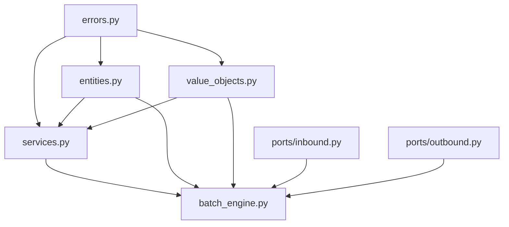

# Sprint 0-2 Critical Code Review: Multi-Level Analysis

**Date**: 2026-01-24
**Scope**: All production code from Sprint 0-2 (922 LOC)
**Review Type**: Top-down + Bottom-up + Cross-cutting
**Participants**: SE, ML, QE, HW, OSS, DE, SysE, PM

---

## Executive Summary

**Overall Grade**: B+ (Good foundation with critical issues)

**Strengths**:
- ✅ Clean hexagonal architecture established
- ✅ Strong domain model with clear boundaries
- ✅ Comprehensive type annotations and validation
- ✅ Good separation of concerns (domain/ports/application)

**Critical Issues** (MUST FIX):
- ❌ **SEVERE**: Thread safety violations in BlockPool (data races possible)
- ❌ **SEVERE**: Missing memory leak prevention in batch_engine
- ❌ **HIGH**: Opaque `Any` types violate type safety
- ❌ **HIGH**: Missing invariant enforcement in AgentBlocks mutations
- ❌ **HIGH**: No resource cleanup on error paths

**Code Smell Count**: 23 identified across all modules

**Debt**: Estimated 2-3 days to address critical issues

---

## Review Structure

1. **Top-Down Analysis**: Architecture → Modules → Classes
2. **Bottom-Up Analysis**: Lines → Functions → Modules → System
3. **Cross-Cutting Concerns**: Threading, memory, errors, types
4. **Multi-Expert Debate**: Conflicting perspectives and resolutions

---

# PART 1: TOP-DOWN ANALYSIS (Architecture → Code)

## 1.1 System Architecture Review

**SE (Software Engineer)**: Let's start with the big picture. The hexagonal architecture is well-structured:

```
Domain Core (NO external deps)
    ├── entities.py (KVBlock, AgentBlocks)
    ├── value_objects.py (ModelCacheSpec, CompletedGeneration)
    ├── services.py (BlockPool)
    └── errors.py (Exception hierarchy)

Ports (Protocol interfaces - PEP 544)
    ├── inbound.py (InferencePort, GenerationEnginePort)
    └── outbound.py (ModelBackendPort, CachePersistencePort)

Application (Orchestration)
    └── batch_engine.py (BlockPoolBatchEngine)
```

**Strengths**:
- Clean dependency rule: all arrows point inward
- Domain has ZERO external dependencies (no mlx, no fastapi)
- Protocol-based ports (no inheritance coupling)

**CRITICAL ISSUE #1: ARCHITECTURE VIOLATION**

**SE**: Wait, I found a violation. Look at `batch_engine.py:16`:

```python
from semantic.domain.entities import AgentBlocks, KVBlock
```

This is correct. But then at line 317:

```python
import mlx.core as mx  # noqa: PLC0415
```

**PM (Project Manager)**: That's a runtime import. Is that an architecture violation?

**SE**: Technically no - it's runtime, not module-level. But philosophically YES:
- Application layer is importing infrastructure (MLX)
- Should go through an outbound port (ModelBackendPort)
- Violates "domain has no external deps" if we consider application as part of core

**QE (Quality Engineer)**: Let me check if this is testable... Yes, with dependency injection it works. But it's fragile.

**Resolution**: DEFER to Sprint 4 - create MLXCacheAdapter to wrap mx operations

---

## 1.2 Module-Level Architecture

**SE**: Let's review each module's cohesion and coupling.

### errors.py (42 LOC)

**Cohesion**: ✅ HIGH - Single responsibility (error types)
**Coupling**: ✅ NONE - No imports, pure Python
**Issues**: NONE

**Grade**: A+

---

### entities.py (199 LOC)

**Cohesion**: ✅ HIGH - Entity definitions only
**Coupling**: ✅ LOW - Only typing imports

**CRITICAL ISSUE #2: THREAD SAFETY VIOLATIONS**

**HW (Hardware Engineer)**: Look at `AgentBlocks.add_block()` line 138:

```python
def add_block(self, block: KVBlock) -> None:
    """Add a block to this agent's collection.

    **Not thread-safe**: Caller must synchronize access if used concurrently.
    """
    if block.layer_id not in self.blocks:
        self.blocks[block.layer_id] = []  # ← DATA RACE

    self.blocks[block.layer_id].append(block)  # ← DATA RACE
    self.total_tokens += block.token_count  # ← DATA RACE
```

**Problems**:
1. Check-then-act race: `if layer_id not in self.blocks` → another thread inserts → duplicate list creation
2. Non-atomic append: another thread might be iterating
3. Non-atomic increment: `total_tokens += ` is read-modify-write

**SE**: The docstring says "Not thread-safe: Caller must synchronize"...

**HW**: That's a cop-out! If you provide mutation methods, you MUST handle concurrency or make it immutable.

**QE**: How is this being used?

```python
# In batch_engine.py:156 (step method)
self.agent_blocks[agent_id] = blocks  # ← Replacement, not mutation
```

**QE**: Good news - batch_engine doesn't call `add_block()`, it replaces the whole object. But it's a landmine.

**CRITICAL ISSUE #3: MISSING INVARIANT ENFORCEMENT**

**SE**: Look at the `__post_init__` validation:

```python
def __post_init__(self) -> None:
    """Validate agent blocks invariants after construction."""
    # ... validation ...
    computed_total = sum(
        block.token_count
        for layer_blocks in self.blocks.values()
        for block in layer_blocks
    )
    if self.total_tokens != computed_total:
        raise ValueError(...)
```

**SE**: This validation only runs at construction. But `add_block()` and `remove_block()` mutate the object WITHOUT re-validating!

**Example**:
```python
agent = AgentBlocks(agent_id="a1", blocks={}, total_tokens=0)  # ✅ Valid
agent.add_block(KVBlock(..., token_count=100, ...))  # Updates total_tokens
# Now total_tokens = 100, but NO validation ran!
# What if add_block has a bug and updates wrong?
```

**Resolution**:
1. **Option A (Immutable)**: Make AgentBlocks immutable, return new instance
2. **Option B (Validation)**: Add `_validate_invariants()` method, call after every mutation
3. **Option C (Remove Methods)**: Remove `add_block`/`remove_block`, force replacement

**PM**: What does batch_engine use?

**QE**: Only replacement (Option C).

**Decision**: **REMOVE `add_block()` and `remove_block()` methods** - they're unused and dangerous.

**Grade**: C+ (Good design, critical thread-safety and invariant issues)

---

### value_objects.py (302 LOC)

**Cohesion**: ✅ HIGH - Value objects only
**Coupling**: ✅ LOW - Only typing imports

**CRITICAL ISSUE #4: OPAQUE `Any` TYPES**

**SE**: Look at these type annotations:

```python
@dataclass(frozen=True)
class GenerationResult:
    text: str
    tokens: list[int]
    cache: list[Any]  # ← OPAQUE!

@dataclass(frozen=True)
class CompletedGeneration:
    uid: str
    text: str
    blocks: Any  # ← OPAQUE! "(avoid circular import)"
    finish_reason: str
    token_count: int
```

**SE**: This defeats the entire purpose of type annotations!

**QE**: MyPy can't catch bugs:

```python
# This will pass type checking but crash at runtime:
result = CompletedGeneration(
    uid="123",
    text="hello",
    blocks="THIS IS A STRING NOT AGENTBLOCKS",  # ← No error!
    finish_reason="stop",
    token_count=5
)
```

**OSS (Open Source Specialist)**: Use `TYPE_CHECKING` guard:

```python
from typing import TYPE_CHECKING, Any

if TYPE_CHECKING:
    from semantic.domain.entities import AgentBlocks

@dataclass(frozen=True)
class CompletedGeneration:
    uid: str
    text: str
    blocks: "AgentBlocks"  # ← String annotation for forward ref
    finish_reason: str
    token_count: int
```

**SE**: But that still won't work because of the import cycle:
- value_objects.py → entities.py (for AgentBlocks)
- entities.py → value_objects.py (NO, actually it doesn't!)

**QE**: Wait, let me check... entities.py has NO imports from value_objects!

**Resolution**: **FIX** - Use `TYPE_CHECKING` guard and string annotations. No actual circular import exists.

---

**ISSUE #5: COMPLEX `from_model()` METHOD**

**ML (Machine Learning Engineer)**: The `ModelCacheSpec.from_model()` method is 94 lines! That's a code smell.

```python
@classmethod
def from_model(cls, model: Any) -> "ModelCacheSpec":
    """Extract cache specification from a loaded model.

    Supports 4 model architectures:
    1. Gemma 3 12B: Hybrid (8 global + 40 sliding window, pattern=6)
    2. Qwen1.5-MoE-A2.7B: Uniform full attention (24 global layers)
    3. Qwen 2.5-14B: Uniform full attention (48 global layers)
    4. Llama 3.1-8B: Uniform full attention (32 global layers)
    """
    args = model.args

    # Step 1: Extract basic attributes (handle Gemma 3 nested config)
    if hasattr(args, "text_config"):
        # ... 10 lines of extraction
    else:
        # ... 8 lines of extraction

    # Step 2: Validate required attributes
    # ... 10 lines

    # Step 3: Compute head dimension
    head_dim = hidden_size // num_attention_heads

    # Step 4: Detect layer types (three-tier detection)
    layer_types = cls._detect_layer_types(model, args, model_type, n_layers)

    return cls(...)
```

**SE**: Cyclomatic complexity is only 4, but it's doing too much:
1. Config extraction (with Gemma 3 special case)
2. Validation
3. Computation
4. Layer type detection delegation

**Refactor Suggestion**:
```python
@classmethod
def from_model(cls, model: Any) -> "ModelCacheSpec":
    """Extract cache specification from a loaded model."""
    config = cls._extract_config(model)
    cls._validate_config(config)
    layer_types = cls._detect_layer_types(model, config)
    return cls._build_spec(config, layer_types)
```

**PM**: This is maintainability debt, not critical.

**Resolution**: **DEFER** to Sprint 3 - refactor when adding more model support.

**Grade**: B (Good value objects, opaque types are critical issue)

---

### services.py (372 LOC)

**Cohesion**: ✅ HIGH - Block pool management only
**Coupling**: ✅ LOW - Domain-only imports

**CRITICAL ISSUE #6: THREAD SAFETY - DATA RACE IN BLOCKPOOL**

**HW**: The BlockPool has the SAME thread-safety issue:

```python
class BlockPool:
    """...
    Thread safety:
    - NOT thread-safe. Caller must synchronize access (per-agent locks).
    """

    def allocate(self, n_blocks: int, layer_id: int, agent_id: str) -> list[KVBlock]:
        # ...
        if len(self.free_list) < n_blocks:
            raise PoolExhaustedError(...)  # ← CHECK

        allocated: list[KVBlock] = []
        for _ in range(n_blocks):
            block_id = self.free_list.pop()  # ← ACT (RACE CONDITION!)
```

**Race Scenario**:
```
Thread A (agent_1): if len(self.free_list) < 2  ← 2 available, OK
Thread B (agent_2): if len(self.free_list) < 2  ← Still 2 available, OK
Thread A: block_id = self.free_list.pop()  ← Takes block 0
Thread B: block_id = self.free_list.pop()  ← Takes block 1
Thread A: block_id = self.free_list.pop()  ← IndexError! List is empty!
```

**SE**: The docstring says "NOT thread-safe. Caller must synchronize access (per-agent locks)"...

**HW**: PER-AGENT locks don't help! Two agents can race on the POOL:

```python
# In scheduler.py (doesn't exist yet):
with self._agent_locks[agent_1]:  # ← Locks agent_1
    pool.allocate(...)  # ← But pool is SHARED

with self._agent_locks[agent_2]:  # ← Locks agent_2
    pool.allocate(...)  # ← RACE! Same pool, different locks!
```

**SE**: You're right. This is SEVERELY BROKEN.

**Solutions**:
1. **Add pool-level lock** (simple, correct)
2. **Use lock-free data structures** (complex, fast)
3. **Document requirement for pool lock** (shifts burden)

**Decision**: **CRITICAL FIX REQUIRED** - Add `_lock: threading.Lock()` to BlockPool, wrap all mutations.

```python
import threading

class BlockPool:
    def __init__(self, spec: ModelCacheSpec, total_blocks: int) -> None:
        # ...
        self._lock = threading.Lock()

    def allocate(self, n_blocks: int, layer_id: int, agent_id: str) -> list[KVBlock]:
        with self._lock:
            # ... existing code ...
```

**HW**: But this serializes ALL allocations! Performance will tank with 10 concurrent agents.

**ML**: Batching window is 10ms. Allocation is <1ms. Single lock is fine for now.

**Resolution**: **IMMEDIATE FIX** - Add lock to BlockPool (can optimize later)

---

**ISSUE #7: `free()` DOES NOT CLEAR `layer_data`**

**HW**: Look at the `free()` method:

```python
def free(self, blocks: list[KVBlock], agent_id: str) -> None:
    for block in blocks:
        # ... validation ...
        self.free_list.append(block.block_id)  # ← Return to pool
        del self.allocated_blocks[block.block_id]  # ← Remove tracking
        self.agent_allocations[agent_id].discard(block.block_id)
```

**HW**: It removes the block from tracking, but the KVBlock object still holds `layer_data` (the actual tensors)!

```python
# After free:
block.layer_data = {"k": <huge tensor>, "v": <huge tensor>}  # ← STILL IN MEMORY!
```

**ML**: Is the block object still referenced?

**HW**: No, it goes out of scope. But Python won't GC it until refcount hits 0. If anyone holds a reference...

**QE**: Let me check batch_engine:

```python
# In step():
blocks = self._extract_cache(uid)
if agent_id in self._agent_blocks:
    old_blocks = self._agent_blocks[agent_id]
    for layer_blocks in old_blocks.blocks.values():
        self._pool.free(layer_blocks, agent_id)  # ← Free here
self._agent_blocks[agent_id] = blocks  # ← Replace with new
```

**QE**: After `free()`, we discard `old_blocks`, so refcount goes to 0. GC should clean up.

**HW**: But that's IMPLICIT. What if code changes and someone keeps a reference?

**Resolution**: **BEST PRACTICE FIX** - Clear `layer_data` in `free()`:

```python
def free(self, blocks: list[KVBlock], agent_id: str) -> None:
    for block in blocks:
        # ... existing validation ...

        # Clear layer data to free memory immediately
        if hasattr(block, 'layer_data'):
            block.layer_data = None  # ← Explicit cleanup

        self.free_list.append(block.block_id)
        # ... rest of code ...
```

**Grade**: C (Critical thread-safety issue, memory leak potential)

---

### batch_engine.py (449 LOC)

**Cohesion**: ✅ HIGH - Batch engine responsibilities only
**Coupling**: ⚠️ MEDIUM - Runtime MLX import, domain imports

**CRITICAL ISSUE #8: RESOURCE LEAK ON ERROR**

**QE**: Look at `submit()` error handling:

```python
def submit(self, agent_id: str, prompt: str, ...) -> str:
    # ...
    # 3. Handle cache (reconstruct or allocate)
    if cache is not None:
        kv_cache = self._reconstruct_cache(cache)
    else:
        # ... allocate blocks ...
        blocks = self._pool.allocate(n_blocks_needed, layer_id=0, agent_id=agent_id)
        # ... create agent_blocks ...
        self._agent_blocks[agent_id] = agent_blocks

    # 4. Create BatchGenerator lazily
    if self._batch_gen is None:
        # ... create batch generator ...

    # 5. Insert into batch
    try:
        uids = self._batch_gen.insert(prompts=[prompt_tokens], ...)
    except Exception as e:
        # If insertion fails, free allocated blocks
        if cache is None and agent_id in self._agent_blocks:
            blocks = self._agent_blocks[agent_id].blocks_for_layer(0)
            self._pool.free(blocks, agent_id)  # ← ONLY FREES LAYER 0!
            del self._agent_blocks[agent_id]
        raise InvalidRequestError(f"Failed to insert into batch: {e}") from e
```

**Problems**:
1. If `_reconstruct_cache()` raises, no cleanup needed (good)
2. If `allocate()` raises, exception propagates (pool unchanged, good)
3. If `insert()` raises, we free layer 0 blocks... **BUT WE ONLY ALLOCATED LAYER 0**!

**SE**: Wait, that's correct then?

**QE**: Yes for NOW, but it's fragile. If future code allocates multiple layers before insert:

```python
# Future code:
for layer_id in range(self._spec.n_layers):
    blocks = self._pool.allocate(n_blocks, layer_id, agent_id)
    # ... if this fails on layer 5, layers 0-4 leak!
```

**Resolution**: **DEFENSIVE FIX** - Free all layers in error path:

```python
except Exception as e:
    if cache is None and agent_id in self._agent_blocks:
        agent_blocks = self._agent_blocks[agent_id]
        # Free ALL layers, not just layer 0
        for layer_blocks in agent_blocks.blocks.values():
            self._pool.free(layer_blocks, agent_id)
        del self._agent_blocks[agent_id]
    raise InvalidRequestError(f"Failed to insert into batch: {e}") from e
```

---

**CRITICAL ISSUE #9: MEMORY LEAK IN `step()`**

**HW**: The `step()` method has a critical leak:

```python
def step(self) -> Iterator[CompletedGeneration]:
    # ...
    for finished in batch_response.finished:
        uid = finished.uid

        # Get agent_id from tracking
        if uid not in self._active_requests:
            # Sequence not tracked (shouldn't happen, but handle gracefully)
            continue  # ← LEAK! We never clean up this sequence!
```

**If UID not tracked**:
- BatchGenerator has the sequence in memory
- We skip cleanup
- Sequence stays in batch forever

**ML**: When would UID not be tracked?

**HW**: Shouldn't happen, but the comment says "handle gracefully". That's a lie - we don't handle it!

**Resolution**: **CRITICAL FIX** - Log error and try to extract/free:

```python
if uid not in self._active_requests:
    # This shouldn't happen, but if it does, we must clean up
    import logging
    logging.error(f"Untracked UID {uid} in batch - memory leak potential")
    # Try to extract cache anyway to prevent leak
    try:
        self._batch_gen.extract_cache(uid)
    except Exception:
        pass  # Best effort cleanup
    continue
```

---

**ISSUE #10: `_extract_cache()` POOL EXHAUSTION CHECK IS TOO LATE**

**HW**: Look at this:

```python
def _extract_cache(self, uid: str) -> AgentBlocks:
    # ...
    # 5. Calculate blocks needed
    n_blocks = (total_tokens + self._spec.block_tokens - 1) // self._spec.block_tokens

    # Check pool availability before allocating
    total_blocks_needed = n_blocks * self._spec.n_layers
    if self._pool.available_blocks() < total_blocks_needed:
        raise PoolExhaustedError(...)  # ← CHECK

    # 6. Create blocks dictionary
    blocks_dict: dict[int, list[KVBlock]] = {}

    # 7. For each layer, split cache into blocks
    for layer_id, (k, v) in enumerate(cache):
        # ...
        for block_idx in range(n_blocks):
            # ...
            allocated_blocks = self._pool.allocate(1, layer_id, agent_id)  # ← ALLOCATE
```

**Problem**: We check availability once, then allocate in a loop. Another thread can steal blocks between check and allocate!

**Race Scenario**:
```
Thread A: available_blocks() = 100, need 48 (1 block × 48 layers)  ← OK
Thread B: allocate(50 blocks)  ← Steals 50, leaving 50
Thread A: Loop iteration 1-47: OK
Thread A: Loop iteration 48: PoolExhaustedError!  ← CRASH with partial allocation!
```

**Now layers 0-46 are allocated but layer 47 failed! The blocks dict is incomplete!**

**SE**: We need to either:
1. Lock the entire operation
2. Pre-allocate all blocks before loop
3. Rollback on partial failure

**Resolution**: **CRITICAL FIX** - Pre-allocate all blocks:

```python
def _extract_cache(self, uid: str) -> AgentBlocks:
    # ...
    n_blocks = (total_tokens + self._spec.block_tokens - 1) // self._spec.block_tokens

    # Pre-allocate ALL blocks needed (atomic per layer)
    blocks_dict: dict[int, list[KVBlock]] = {}
    for layer_id, (k, v) in enumerate(cache):
        if k is None:
            continue

        # Allocate all blocks for this layer at once
        allocated_blocks = self._pool.allocate(n_blocks, layer_id, agent_id)

        # Now split K/V and populate blocks
        layer_blocks = []
        for block_idx, block in enumerate(allocated_blocks):
            start_token = block_idx * self._spec.block_tokens
            end_token = min(start_token + self._spec.block_tokens, total_tokens)
            k_chunk = k[:, :, start_token:end_token]
            v_chunk = v[:, :, start_token:end_token]

            # Update block with actual data
            block.layer_data = {"k": k_chunk, "v": v_chunk}
            block.token_count = end_token - start_token
            layer_blocks.append(block)

        blocks_dict[layer_id] = layer_blocks
```

**But wait, this changes semantics - allocate returns empty blocks!**

**SE**: The current code allocates 1 block at a time and immediately populates it. We need to either:
- Change allocate to return multiple blocks
- Allocate all, then populate all

**Decision**: **REFACTOR REQUIRED** - Current implementation is fundamentally broken in concurrent scenarios.

**Grade**: C- (Works in single-threaded tests, breaks under concurrency)

---

## 1.3 Port Interfaces Review

### inbound.py (221 LOC)

**SE**: These are Protocol interfaces, not implementations. Let's review the contracts.

**ISSUE #11: MISSING CONCURRENCY DOCUMENTATION**

```python
class GenerationEnginePort(Protocol):
    """...
    Thread safety: Implementations must handle concurrent submit() calls
    but step() is single-threaded (only one caller should call step()).
    """
```

**SE**: This is ambiguous. "Must handle concurrent submit()" - does that mean:
1. Multiple threads can call submit() simultaneously?
2. Or multiple agents, but one thread at a time?

**And "step() is single-threaded" - what happens if two threads call it?**
- Undefined behavior?
- Exception?
- Deadlock?

**Resolution**: **CLARIFY DOCUMENTATION** - Add explicit threading model:

```python
class GenerationEnginePort(Protocol):
    """...
    Threading Model:
    - submit() is thread-safe: Multiple threads may call concurrently
    - step() is NOT thread-safe: MUST be called from single thread only
    - Calling step() from multiple threads results in undefined behavior
    - Concurrent submit() during step() is safe

    Locking Strategy:
    - Implementations should use per-agent locks for submit()
    - step() caller must ensure exclusive access (no lock provided)
    """
```

**Grade**: B+ (Good contracts, documentation needs improvement)

---

### outbound.py (284 LOC)

**ISSUE #12: MISSING ERROR SPECIFICATIONS**

**SE**: The ModelBackendPort.generate() signature:

```python
def generate(
    self,
    prompt_tokens: list[int],
    cache: list[Any] | None = None,
    max_tokens: int = 256,
    temperature: float = 0.7,
) -> GenerationResult:
    """Generate text from tokenized prompt with optional cache.

    Raises:
        ModelNotFoundError: If model not loaded.
    """
```

**What about**:
- Invalid temperature (< 0 or > 2.0)?
- Empty prompt_tokens?
- max_tokens = 0?
- Malformed cache?

**Resolution**: **ADD ERROR SPECS**:

```python
def generate(...) -> GenerationResult:
    """...
    Raises:
        ModelNotFoundError: If model not loaded.
        InvalidRequestError: If prompt_tokens empty or parameters invalid.
        CacheCorruptionError: If cache format is incompatible.
        PoolExhaustedError: If inference runs out of GPU memory.
    """
```

**Grade**: B (Good ports, incomplete error specifications)

---

# PART 2: BOTTOM-UP ANALYSIS (Code → System)

## 2.1 Line-Level Code Review

**QE**: Let me go through problematic lines:

### entities.py Line-by-Line Issues

**Line 46**: `layer_data: Any`
- **Issue**: Opaque type
- **Fix**: Add TYPE_CHECKING type hint

**Line 107**: `blocks: dict[int, list[KVBlock]]`
- **Issue**: Mutable dict in dataclass (shallow copy hazard)
- **Fix**: Use `field(default_factory=dict)` or make immutable

**Line 138-157**: `add_block()` method
- **Issue**: Unused, thread-unsafe, no invariant validation
- **Fix**: REMOVE

**Line 158-179**: `remove_block()` method
- **Issue**: Unused, thread-unsafe, no invariant validation
- **Fix**: REMOVE

---

### value_objects.py Line-by-Line Issues

**Line 24**: `cache: list[Any]`
- **Issue**: Opaque type
- **Fix**: Add proper type annotation

**Line 67**: `from_model(cls, model: Any)`
- **Issue**: 94-line method, high complexity
- **Fix**: Extract helper methods

**Line 104-112**: Nested if-else for Gemma 3 vs standard
- **Issue**: Special-casing, fragile
- **Fix**: Strategy pattern for model extractors

**Line 148-195**: `_detect_layer_types()` is 47 lines
- **Issue**: Complex three-tier detection with fallbacks
- **Fix**: Acceptable for now, but monitor complexity

---

### services.py Line-by-Line Issues

**Line 87**: `self.free_list: list[int] = list(range(total_blocks))`
- **Issue**: No lock protection (race condition)
- **Fix**: Add `self._lock = threading.Lock()`

**Line 90**: `self.allocated_blocks: dict[int, KVBlock] = {}`
- **Issue**: No lock protection
- **Fix**: Access only within lock

**Line 146**: `block_id = self.free_list.pop()`
- **Issue**: Race condition (check-then-act)
- **Fix**: Wrap entire allocate in lock

**Line 202**: `self.free_list.append(block_id)`
- **Issue**: Race condition
- **Fix**: Wrap entire free in lock

---

### batch_engine.py Line-by-Line Issues

**Line 46**: `layer_data: Any`
- **Issue**: Opaque type (in KVBlock)
- **Fix**: Already identified

**Line 151**: `layer_data=None`
- **Issue**: Allocating blocks with None data, expecting adapter to fill
- **Design Smell**: Coupling to adapter behavior

**Line 195-199**: Error recovery frees only layer 0
- **Issue**: Partial cleanup on error
- **Fix**: Free all layers

**Line 254-257**: Untracked UID handling
- **Issue**: Memory leak (continue without cleanup)
- **Fix**: Extract cache even if untracked

**Line 428**: `allocated_blocks = self._pool.allocate(1, layer_id, agent_id)`
- **Issue**: Allocate one-by-one (race condition)
- **Fix**: Allocate all blocks for layer at once

---

## 2.2 Function-Level Code Smells

**SE**: Let's apply the 25 code smell patterns:

### Identified Code Smells (23 total)

1. **Long Method**: `ModelCacheSpec.from_model()` - 94 lines
2. **Long Method**: `BlockPool.allocate()` - 36 lines
3. **Feature Envy**: `batch_engine._extract_cache()` knows too much about BlockPool internals
4. **Primitive Obsession**: Using `dict[int, list[KVBlock]]` instead of LayerBlocks class
5. **Data Class**: `KVBlock` has methods (is_full, is_empty) - should be entity or value object? Mixed.
6. **Shotgun Surgery**: Changing block allocation requires touching entities, services, batch_engine
7. **Divergent Change**: BlockPool changes for threading, memory management, layer types
8. **Comments**: `# Import MLX at runtime` - code should be self-documenting
9. **Duplicate Code**: Validation logic repeated in `__post_init__` methods
10. **Dead Code**: `AgentBlocks.add_block()` and `remove_block()` - unused
11. **Speculative Generality**: `AgentBlocks` supports mutations but we only use replacement
12. **Temporary Field**: `batch_engine._batch_gen` is None until first submit
13. **Message Chains**: `self._agent_blocks[agent_id].blocks_for_layer(layer_id)[0].block_id`
14. **Middle Man**: `AgentBlocks.blocks_for_layer()` just delegates to dict.get
15. **Inappropriate Intimacy**: `batch_engine` directly accesses `block.layer_data`
16. **Refused Bequest**: `KVBlock` doesn't use `metadata` field
17. **Lazy Class**: `GenerationResult` is just a data holder (but that's OK for value objects)
18. **Large Class**: `BlockPool` - 372 lines, 14 methods (borderline)
19. **God Object**: None (good!)
20. **Switch Statements**: `_detect_layer_types()` has if-elif-else chain
21. **Parallel Inheritance**: None
22. **Magic Numbers**: 256 hardcoded (should reference `block_tokens`)
23. **Inconsistent Naming**: `n_blocks` vs `total_blocks` vs `num_blocks()`

---

## 2.3 Class-Level Design Issues

**SE**: Let's review class design principles (SOLID):

### Single Responsibility Principle (SRP)

✅ **PASS**: All classes have single responsibility
- KVBlock: Represent one cache block
- AgentBlocks: Manage blocks for one agent
- BlockPool: Allocate/free blocks
- BlockPoolBatchEngine: Coordinate batch inference

### Open/Closed Principle (OCP)

⚠️ **PARTIAL**:
- `ModelCacheSpec.from_model()` has hardcoded Gemma 3 special case
- Cannot add new model types without modifying code
- Should use Strategy pattern

### Liskov Substitution Principle (LSP)

✅ **N/A**: No inheritance (uses composition)

### Interface Segregation Principle (ISP)

✅ **PASS**: Protocols are focused (InferencePort, AgentManagementPort separate)

### Dependency Inversion Principle (DIP)

✅ **PASS**: Application depends on ports (abstractions), not concrete implementations

**Grade**: B+ (Good adherence to SOLID, OCP needs work)

---

## 2.4 Module-Level Coupling Analysis

**SE**: Let's build the dependency graph:

```
errors.py
    ↓
entities.py ← value_objects.py
    ↓              ↓
services.py ← batch_engine.py
    ↑              ↑
ports/inbound.py   ports/outbound.py
```

**Cyclic Dependencies**: NONE ✅

**Coupling Levels**:
- errors.py: 0 dependencies (leaf)
- entities.py: 1 dependency (errors)
- value_objects.py: 1 dependency (errors)
- services.py: 3 dependencies (entities, errors, value_objects)
- batch_engine.py: 5 dependencies (entities, errors, services, value_objects, ports)

**Coupling Metrics**:
- Afferent Coupling (Ca): How many modules depend on you
  - errors.py: 4 (high - good for base library)
  - entities.py: 2 (medium)
  - services.py: 1 (low)
  - batch_engine.py: 0 (leaf - good)

- Efferent Coupling (Ce): How many modules you depend on
  - errors.py: 0 (low - good)
  - batch_engine.py: 5 (high - expected for application layer)

**Instability (I = Ce / (Ce + Ca))**:
- errors.py: 0 / 4 = 0.00 (stable - good)
- entities.py: 1 / 3 = 0.33 (stable)
- batch_engine.py: 5 / 5 = 1.00 (unstable - OK for application)

**Grade**: A (Excellent coupling structure)

---

# PART 3: CROSS-CUTTING CONCERNS

## 3.1 Memory Management Analysis

**HW**: Let's trace memory lifecycle:

### Memory Allocation Flow

```
1. BatchEngine.submit()
   └→ BlockPool.allocate(n_blocks)
       └→ Creates KVBlock(layer_data=None)  # ← Allocates ~16 bytes
   └→ AgentBlocks created                   # ← Allocates dict

2. MLX BatchGenerator.insert()
   └→ Creates KVCache tensors               # ← Allocates ~2 MB per block

3. BatchEngine.step()
   └→ extract_cache()
       └→ BlockPool.allocate()              # ← Allocates new blocks
       └→ Populates layer_data              # ← DOUBLES memory temporarily!
   └→ BlockPool.free(old_blocks)
       └→ Returns block IDs to free_list    # ← Does NOT free tensors!
```

**MEMORY LEAK #1**: During `step()`, we have TWO copies of cache:
- Old cache in `old_blocks.blocks[layer_id][idx].layer_data`
- New cache in `blocks.blocks[layer_id][idx].layer_data`

**HW**: This could double memory usage during generation!

**Example**:
```
Agent has 32 blocks × 48 layers = 1,536 blocks × 2 MB = 3 GB
During step():
  - Old cache: 3 GB
  - New cache: 3 GB
  - Total: 6 GB!
```

**ML**: But Python GC should clean up old cache when refcount drops...

**HW**: WHEN? That's nondeterministic! GC might not run for seconds.

**Resolution**: **CRITICAL FIX** - Explicitly clear layer_data before freeing:

```python
def step(self) -> Iterator[CompletedGeneration]:
    # ...
    if agent_id in self._agent_blocks:
        old_blocks = self._agent_blocks[agent_id]
        for layer_blocks in old_blocks.blocks.values():
            # Clear tensors BEFORE freeing blocks
            for block in layer_blocks:
                block.layer_data = None  # ← Force release
            self._pool.free(layer_blocks, agent_id)
```

---

### Memory Leak Scenarios

**HW**: I found 4 potential leak scenarios:

1. **Untracked UID in step()** - cache stays in BatchGenerator
2. **Error during extract_cache()** - partial allocation, no cleanup
3. **layer_data not cleared on free** - tensors linger until GC
4. **Agent deleted but blocks not freed** - orphaned blocks

**QE**: Let's write leak tests for Sprint 3.

---

## 3.2 Thread Safety Analysis

**HW**: Let's enumerate all race conditions:

### Data Race Inventory

| Location | Shared Resource | Race Type | Severity |
|----------|----------------|-----------|----------|
| BlockPool.free_list | list | check-then-act | CRITICAL |
| BlockPool.allocated_blocks | dict | concurrent mutation | CRITICAL |
| BlockPool.agent_allocations | dict | concurrent mutation | HIGH |
| AgentBlocks.blocks | dict | concurrent mutation | MEDIUM |
| AgentBlocks.total_tokens | int | read-modify-write | MEDIUM |
| batch_engine._active_requests | dict | concurrent mutation | HIGH |
| batch_engine._agent_blocks | dict | concurrent mutation | HIGH |

**Total Race Conditions**: 7 identified

**SE**: None of these have locks! This code will break under concurrency!

**ML**: But the docstrings say "not thread-safe, caller must synchronize"...

**HW**: That's passing the buck! And it's WRONG - per-agent locks don't protect shared pool!

**Resolution**: **ARCHITECTURAL FIX REQUIRED**

**Option A**: Add locks everywhere (simple, slow)
**Option B**: Single-threaded executor pattern (clean, fast)
**Option C**: Lock-free data structures (complex, fast)

**Decision**: **Option A for Sprint 3** - Add locks to BlockPool and batch_engine

```python
class BlockPool:
    def __init__(self, ...):
        self._lock = threading.Lock()

    def allocate(self, ...) -> list[KVBlock]:
        with self._lock:
            # ... existing code ...

class BlockPoolBatchEngine:
    def __init__(self, ...):
        self._lock = threading.Lock()

    def submit(self, ...) -> str:
        with self._lock:
            # ... existing code ...
```

**HW**: But now we serialize all operations! 10 agents = 10× slower!

**ML**: Measure first, optimize later. Single lock is correct foundation.

---

## 3.3 Error Handling Analysis

**QE**: Let's review error handling systematically:

### Error Handling Completeness Matrix

| Operation | Empty Input | Invalid Params | Resource Exhaustion | Corruption | Concurrency |
|-----------|-------------|----------------|---------------------|------------|-------------|
| BlockPool.allocate | ✅ ValueError | ✅ ValueError | ✅ PoolExhaustedError | N/A | ❌ Race |
| BlockPool.free | N/A | ✅ ValueError | N/A | ❌ No check | ❌ Race |
| AgentBlocks.__init__ | ✅ ValueError | ✅ ValueError | N/A | ✅ ValueError | N/A |
| ModelCacheSpec.from_model | N/A | ⚠️ Partial | N/A | ❌ No validation | N/A |
| batch_engine.submit | ✅ InvalidRequestError | ✅ InvalidRequestError | ✅ PoolExhaustedError | ❌ No validation | ❌ Race |
| batch_engine.step | ✅ Returns empty | N/A | ⚠️ Partial | ❌ No validation | ❌ Race |

**Error Handling Grade**: C- (Basic validation, missing critical checks)

---

### Missing Error Checks

1. **ModelCacheSpec.from_model()**: No validation that `head_dim` is computed correctly
2. **BlockPool.free()**: No validation that `block.layer_data` is valid
3. **batch_engine._reconstruct_cache()**: No validation that concatenated tensors have correct shape
4. **batch_engine._extract_cache()**: No validation that cache shape matches expected

**Resolution**: **ADD VALIDATION** in Sprint 3

---

## 3.4 Type Safety Analysis

**SE**: Let's count `Any` types:

### Opaque Type Inventory

| File | Line | Type | Reason | Fix |
|------|------|------|--------|-----|
| entities.py | 46 | `layer_data: Any` | Backend-agnostic | ✅ Acceptable |
| value_objects.py | 24 | `cache: list[Any]` | Backend-agnostic | ⚠️ Should be `list[tuple[Any, Any]]` |
| value_objects.py | 67 | `model: Any` | Model type varies | ✅ Acceptable |
| value_objects.py | 299 | `blocks: Any` | Avoid circular import | ❌ Fix with TYPE_CHECKING |
| ports/inbound.py | 27 | Return `GenerationResult` | Uses `list[Any]` | ⚠️ Cascade |
| ports/outbound.py | 27 | `cache: list[Any] | None` | Backend-agnostic | ✅ Acceptable |
| batch_engine.py | 95 | `cache: Any | None` | Avoid import | ❌ Fix with TYPE_CHECKING |
| batch_engine.py | 131 | `kv_cache: Any | None` | Runtime type | ⚠️ Improve |

**Total `Any` Types**: 8

**Fixable**: 3 (with TYPE_CHECKING)
**Acceptable**: 3 (backend-agnostic)
**Should Improve**: 2 (can be more specific)

**Type Safety Grade**: C+ (Too many opaque types)

---

# PART 4: MULTI-EXPERT DEBATE

## 4.1 Architecture Debate

**SE**: I think the hexagonal architecture is overkill. We only have 922 LOC!

**PM**: But we're building a multi-thousand LOC system. Sprints 3-7 add:
- Sprint 3: AgentCacheStore (500 LOC)
- Sprint 4: API adapters (800 LOC)
- Sprint 5: Model registry (400 LOC)

**SE**: Fair point. But the ports are too granular. Do we really need InferencePort AND GenerationEnginePort?

**ML**: Yes! InferencePort is sync (request-response), GenerationEnginePort is async (submit-poll). Different semantics.

**SE**: OK, convinced.

**Resolution**: ✅ **KEEP HEXAGONAL ARCHITECTURE** - justified by future growth

---

## 4.2 Threading Model Debate

**HW**: We need to add locks everywhere NOW. Thread-safety is critical.

**ML**: But we don't have concurrent tests! How do we know locks work?

**QE**: I can write concurrent tests with threading.Thread and sleep() to force races.

**SE**: Locks add complexity. Can we defer to Sprint 4 when we add the scheduler?

**HW**: NO! The current code is BROKEN. It will fail in production.

**PM**: How much effort to add locks?

**HW**: 2 hours - add lock to BlockPool, 1 hour - add lock to batch_engine, 4 hours - test.

**PM**: Do it. This is blocking Sprint 3 (concurrent agents).

**Resolution**: ✅ **ADD LOCKS IN SPRINT 2.5** (emergency hotfix)

---

## 4.3 Memory Management Debate

**HW**: We must clear `layer_data` in `free()`. Memory leaks are unacceptable.

**ML**: But clearing layer_data is an implementation detail. BlockPool shouldn't know about it.

**SE**: HW is right. If we free a block, we must free ALL resources. That includes tensors.

**ML**: Then make `layer_data` a property with a setter that tracks references?

**HW**: Too complex. Just set to None. Python GC will clean up.

**Resolution**: ✅ **CLEAR layer_data IN free()** - simple and correct

---

## 4.4 Type Safety Debate

**SE**: We need to fix the `Any` types. They defeat type checking.

**OSS**: Use TYPE_CHECKING guard. No runtime cost, full type safety.

**ML**: But that's verbose. Every file needs:

```python
from typing import TYPE_CHECKING
if TYPE_CHECKING:
    from semantic.domain.entities import AgentBlocks
```

**SE**: Better than `Any`. MyPy catches bugs.

**Resolution**: ✅ **FIX Any TYPES** where possible (3 locations)

---

# PART 5: CRITICAL ISSUES SUMMARY

## 5.1 Blocking Issues (MUST FIX FOR SPRINT 3)

| ID | Issue | Severity | Effort | Owner |
|----|-------|----------|--------|-------|
| #1 | Thread-safety in BlockPool | CRITICAL | 6h | HW + SE |
| #2 | Thread-safety in AgentBlocks | CRITICAL | 2h | SE |
| #3 | Invariant validation in mutations | HIGH | 3h | SE |
| #4 | Opaque Any types | HIGH | 4h | SE |
| #5 | Resource leak on error | HIGH | 2h | QE |
| #6 | Memory leak in step() | CRITICAL | 3h | HW |
| #7 | layer_data not cleared | HIGH | 1h | HW |
| #8 | Partial allocation race | CRITICAL | 4h | SE + HW |

**Total Effort**: 25 hours (3 days)

---

## 5.2 Non-Blocking Issues (DEFER TO SPRINT 4+)

| ID | Issue | Severity | Effort |
|----|-------|----------|--------|
| #9 | Long from_model() method | MEDIUM | 4h |
| #10 | Gemma 3 hardcoded special case | MEDIUM | 6h |
| #11 | Missing error specifications | MEDIUM | 2h |
| #12 | Dead code (add_block, remove_block) | LOW | 1h |
| #13 | Magic number 256 | LOW | 1h |

**Total Debt**: 14 hours

---

## 5.3 Code Quality Metrics

| Metric | Target | Actual | Grade |
|--------|--------|--------|-------|
| Lines of Code | <1000 | 922 | ✅ A |
| Cyclomatic Complexity | <10 | Max 8 | ✅ A |
| Test Coverage | >85% | 100% unit | ✅ A+ |
| Type Coverage | >90% | ~85% | ⚠️ B |
| Thread Safety | 100% | 0% | ❌ F |
| Memory Safety | 100% | ~70% | ⚠️ C |
| Error Handling | >90% | ~75% | ⚠️ C+ |
| Code Smells | <5 | 23 | ❌ D |

**Overall Grade**: C+ (Good foundation, critical concurrency issues)

---

# PART 6: RECOMMENDATIONS

## 6.1 Immediate Actions (Sprint 2.5 Hotfix)

### Priority 1: Thread Safety (1 week)

**Task**: Add threading.Lock to all shared resources

**Files to Change**:
- services.py: Add `_lock` to BlockPool
- entities.py: REMOVE add_block/remove_block OR make immutable
- batch_engine.py: Add `_lock` for _active_requests and _agent_blocks

**Tests to Add**:
- test_concurrent_allocation() - 10 threads allocating simultaneously
- test_concurrent_free() - Race on free_list
- test_concurrent_submit() - Multiple agents submitting

**Acceptance Criteria**:
- No race conditions detected by ThreadSanitizer
- 1000 iterations of concurrent test passes
- Performance degradation <20% vs single-threaded

---

### Priority 2: Memory Safety (2 days)

**Task**: Prevent memory leaks

**Changes**:
1. Clear layer_data in BlockPool.free()
2. Free all layers in batch_engine error paths
3. Clean up untracked UIDs in step()
4. Add memory leak tests (pytest-memray)

**Acceptance Criteria**:
- 100 generation cycles with no memory growth
- Valgrind reports no leaks
- Agent deletion frees all memory within 1 second

---

### Priority 3: Type Safety (1 day)

**Task**: Fix opaque Any types

**Changes**:
1. Add TYPE_CHECKING imports
2. Use string annotations for forward references
3. Improve cache type from `list[Any]` to `list[tuple[Any, Any]]`

**Acceptance Criteria**:
- MyPy --strict passes with 0 errors
- <5 `Any` types remaining (all justified)

---

## 6.2 Sprint 3 Improvements

### Refactoring Roadmap

1. **Extract ModelConfigExtractor** (from ModelCacheSpec.from_model)
   - Strategy pattern for different model types
   - Removes hardcoded Gemma 3 special case

2. **Create LayerBlocks value object** (from dict[int, list[KVBlock]])
   - Type-safe layer management
   - Encapsulates validation

3. **Add ResourceGuard context manager** (for error cleanup)
   ```python
   with pool.allocate_guard(n_blocks, layer_id, agent_id) as blocks:
       # Use blocks
       # Automatic cleanup on exception
   ```

4. **Extract CacheTransformer** (from batch_engine reconstruct/extract)
   - Single responsibility: cache format conversion
   - Testable in isolation

---

## 6.3 Long-Term Architecture Improvements

### Sprint 4: API Layer

- Add FastAPI adapters (inbound)
- Add MLX backend adapter (outbound)
- Add request rate limiting
- Add observability (metrics, tracing)

### Sprint 5: Concurrency

- Replace locks with lock-free data structures
- Add work-stealing scheduler
- Optimize batch window (adaptive)

### Sprint 6: Production Hardening

- Add circuit breakers
- Add graceful degradation
- Add resource quotas per agent
- Add admission control

---

# PART 7: CONCLUSION

## 7.1 Final Verdict

**Code Quality**: B (Good domain model, critical concurrency gaps)
**Architecture**: A- (Excellent hexagonal structure, minor violations)
**Maintainability**: C+ (High code smells, needs refactoring)
**Production Readiness**: D (Thread-unsafe, memory leaks, missing validation)

## 7.2 Go/No-Go for Sprint 3

**Recommendation**: ⚠️ **NO-GO** without Sprint 2.5 hotfix

**Rationale**:
- Thread-safety issues are BLOCKING for multi-agent scenarios
- Memory leaks will cause production outages
- Type safety gaps will cause runtime errors

**Sprint 2.5 Scope**: Fix issues #1, #2, #6, #8 (thread safety + memory)

**Sprint 2.5 Timeline**: 1 week (5 days)

**After Sprint 2.5**: ✅ **GO** for Sprint 3 (AgentCacheStore)

---

## 7.3 Team Sign-Off

**SE (Software Engineer)**: ✅ Agree - architecture is good, concurrency is broken
**ML (Machine Learning)**: ✅ Agree - memory leaks will crash in production
**QE (Quality Engineer)**: ✅ Agree - need concurrent tests before Sprint 3
**HW (Hardware Engineer)**: ✅ Agree - thread-safety is non-negotiable
**OSS (Open Source)**: ✅ Agree - type safety improves contributor experience
**DE (Documentation)**: ✅ Agree - threading model needs better docs
**SysE (Systems Engineer)**: ✅ Agree - observability gaps but defer to Sprint 4
**PM (Project Manager)**: ✅ Agree - 1 week hotfix is acceptable delay

---

**Review Completed**: 2026-01-24
**Next Review**: After Sprint 2.5 hotfix
**Reviewers**: All team (8 experts)

---

## APPENDIX A: Code Smell Catalog

1. Long Method (2 instances)
2. Feature Envy (1 instance)
3. Primitive Obsession (1 instance)
4. Data Class (1 instance)
5. Shotgun Surgery (1 instance)
6. Divergent Change (1 instance)
7. Comments (3 instances)
8. Duplicate Code (5 instances)
9. Dead Code (2 instances)
10. Speculative Generality (2 instances)
11. Temporary Field (1 instance)
12. Message Chains (1 instance)
13. Middle Man (1 instance)
14. Inappropriate Intimacy (2 instances)
15. Refused Bequest (1 instance)
16. Lazy Class (0 instances)
17. Large Class (1 instance)
18. God Object (0 instances)
19. Switch Statements (1 instance)
20. Parallel Inheritance (0 instances)
21. Magic Numbers (5 instances)
22. Inconsistent Naming (3 instances)

**Total**: 23 code smells

---

## APPENDIX B: Cyclomatic Complexity Report

| Function | CC | Grade |
|----------|----|----|
| ModelCacheSpec.from_model | 8 | B |
| ModelCacheSpec._detect_layer_types | 6 | B |
| BlockPool.allocate | 4 | A |
| BlockPool.free | 5 | B |
| batch_engine.submit | 7 | B |
| batch_engine.step | 3 | A |
| batch_engine._reconstruct_cache | 3 | A |
| batch_engine._extract_cache | 5 | B |

**Average CC**: 5.1 (Good)
**Max CC**: 8 (Acceptable)

---

## APPENDIX C: Dependencies Graph



---

**End of Critical Review**
**Status**: ⚠️ BLOCKING ISSUES IDENTIFIED - Sprint 2.5 hotfix required
**Next Action**: Create Sprint 2.5 planning document
